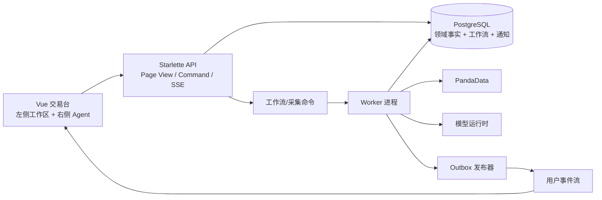

# Finance-God Agent 主控交易台：现状审计与分阶段实施规划

> 日期：2026-07-24
> 范围：当前仓库后端、生产前端与隔离交互原型
> 目标：把“右侧 Agent 主控 + 左侧交易工作区 + 后台周期行情/告警/工作流”拆成可运行、
> 可观测、可回滚的纵向 Phase。

## 1. 结论

当前仓库并不是“只有客户端内容”。它已经包含一个 Starlette API 后端、PandaData 行情适配与
质量门、仿真账户/订单/成交/账本、版本化工作流领域模型与持久化、研究 Agent、通知与自选表。
真正缺少的是四条生产闭环：

1. **行情采集闭环**：现在的行情缓存由请求触发、进程内保存，不能承担定时采集、历史留存和
   重大变动检测。
2. **工作流运行闭环**：已有注册表、状态机、执行器、事件审计和 Outbox，但公开 API 主要承担
   创建/读取能力，尚未形成通用 Worker 消费、进度订阅和最终产物读取链。
3. **提醒闭环**：已有通知表、未读查询和已读回执，没有行情事件生产器、历史分页、实时推送和
   告警规则版本。
4. **Agent 控制闭环**：现有侧栏能绑定路由/标的并运行研究请求，但没有服务端工具目录、
   `AgentUiCommand`、动作回执、工作流流式状态以及受审计的跨侧联动。

建议继续使用一个代码仓库和一套领域模型，运行时拆成 **API 进程 + Worker 进程**。现阶段不拆
微服务：先让同一数据库、同一事件合同和同一状态机形成闭环，避免复制行情、风控、授权和工作流
真相源。

## 2. 需求重述与范围边界

### 2.1 目标用户体验

- 交易台是桌面 Web 工作区，左侧承载信息、持仓、自选、交易记录和仿真钱包；“信息”内部提供
  行情、交易草稿和策略工作态。
- 右侧使用同一个常驻 Agent，绑定当前页面、标的、组合、草稿和数据版本。
- Agent 可以通过白名单语义动作切换工作区、选择标的、调整筛选和填写**未提交草稿**。
- Agent 根据意图调用合适的后端工作流，展示运行步骤；终态自动折叠，仍可展开追溯。
- 输入框下方常驻恰好三条上下文快捷指令。它们是普通内容流，无卡片底、描边或阴影。
- 重大行情、系统异常和工作流异常形成站内提醒；提醒可关闭、可读、可查询历史。
- 用户设置属于用户本人控制面，不进入 Agent 工具目录。

### 2.2 不在本项目范围内

- 实盘券商接入、真实资金托管和 Agent 自主提交/撤销订单。
- 允许模型通过坐标、CSS 选择器或任意 DOM 脚本操作页面。
- 使用 AI 每隔数秒扫描全市场。行情变化检测必须由确定性规则完成，AI 只在事件产生后解释影响。
- 为每个工作流建立一套重复的行情、持仓或通知业务表。

## 3. 当前实现审计

### 3.1 后端能力矩阵

| 能力 | 当前证据 | 当前状态 | 与目标差距 |
| --- | --- | --- | --- |
| API 进程 | `backend/server.py` 使用 Starlette，挂载 market、workspace、simulation、trade-plans、mandate、evidence、agent | 已运行 | 需要增加 desk、workflow、notification stream 合同 |
| PandaData 行情 | `market_data/adapter.py`、`normalization.py`、`quality.py`、`service.py` | 有标准化、质量诊断和错误映射 | 尚无持久化 observation/latest 表与独立调度器 |
| 行情缓存 | `market_data/coordinator.py` 每标的单飞、失败保留旧值；默认 0.9 秒刷新阈值 | 请求触发、进程内 | 进程重启丢失，不能证明长期采集与告警检测 |
| 前端轮询 | `frontend/src/stores/market.ts` 默认 5 秒，可切频率，隐藏页暂停 | 已有共享控制器 | 这是页面刷新，不等于服务端采集计划 |
| 仿真交易 | `api/simulation.py` 暴露账户、草稿、复核、确认、提交、持仓、订单、成交 | 领域流程较完整 | `MarketDataBarProvider` 仍返回 `None`，服务端参考价链需打通 |
| 工作流领域 | `domain/models.py`、`orchestration/workflow_registry.py`、`workflow_executor.py` | 版本、DAG、权限、重试、超时、质量门已存在 | 缺少通用公开 Command/Query/Stream 与持续运行 Worker |
| 工作流持久化 | `workflow_runs/events/audit/outbox/execution_audit` | CAS、幂等、追加事实、Outbox 已有 | 需补领取/租约、进度投影、Outbox 发布器和恢复策略 |
| 研究 Agent | `api/agent_routes.py` + `orchestration/multi_agent.py` | 一次性研究请求 | 与持久工作流是两条运行模型，尚未统一 Run/Artifact |
| 自选 | `workspace_routes.py` + workspace 表 | 查询与维护已存在 | 需要进入 Desk Page View 和 Agent 上下文 |
| 通知 | `notifications`、receipt、preference 表；API 有未读查询/标记已读 | 基础存储已存在 | 没有历史分页、事件生产器、实时流和投递状态 |
| 用户设置 | 现有 Settings 视图与 mandate/notification preference API | 用户控制面已存在 | 需要在 Agent 能力发现阶段显式排除 |

### 3.2 生产前端现状

- `frontend/src/App.vue` 已在认证桌面路由外层挂载一个共享 `AiSidebar`，不是每页复制一个聊天框。
- `frontend/src/stores/aiContext.ts` 已保存收起偏好，并在 1024–1279 px 首次访问默认收起。
- 当前上下文主要由“路由 + 行情标的”单向写入；左侧组件没有统一动作目录，Agent 也不能返回
  可验证的 UI 命令。
- 现有交易台并未覆盖本需求提出的五个局部工作区、三条动态快捷指令、工作流步骤折叠和提醒历史。

### 3.3 不能直接复用或需要修正的点

- 当前 `AgentRun` 与持久 `WorkflowRun` 是两套运行语义。生产实现不能再建立第三套聊天任务状态；
  应由 Agent 负责意图路由，正式任务统一落到 `WorkflowRun`。
- 当前通知领域限制来源对象类型，不能直接表示 `MarketAlertEvent`、`SystemIncident`；应扩展统一
  `source_ref` 合同，而不是把行情事件伪装成订单或工作流。
- 浏览器请求可携带 `reference_price` 的能力不应成为成交或风控事实源。参考价必须由服务端在
  复核时绑定到 PandaData 版本。
- “关闭提醒”“标记已读”“处理完成”是三个不同动作，不能合并成一个布尔值。

## 4. 原需求中的不合理点与修正

| 原表述 | 问题 | 修正后的产品/工程决定 |
| --- | --- | --- |
| “项目整体为 C/S” | 当前产品实际是浏览器 + API；强行做桌面客户端会增加发布、密钥和升级成本 | 保持 B/S UI；服务端内部按 API/Worker 的 C/S 运行关系拆分 |
| “工作流维护一个存储信息的数据表” | 会把业务事实、编排状态和通知重复存入每条工作流，形成多真相源 | 领域表保存事实；工作流表只保存编排、输入版本、节点贡献、产物引用与审计 |
| “间隔可以较长”同时“重大行情自动推送” | 没有检测延迟 SLA，两个要求不可同时验收 | 分层采集：持仓/自选高频、全量低频；UI 显示采集频率、上游时点和最坏检测延迟 |
| 首次“推荐购入股票” | 容易把研究候选表达成个性化买入指令，且初次画像通常不足 | 改为“研究候选”，返回理由、反方证据、未知项、适配标签与数据版本；任何订单仍需计划、复核和用户确认 |
| 自动弹聊天气泡 | 与常驻侧栏和“无悬浮聊天机器人”规范冲突，也会遮挡工作区 | 使用对话内初始化消息 + 输入框下方三条轻量快捷指令 |
| “每个按钮/表单都可被 Agent 获取” | 暴露 DOM 会脆弱、不可授权、不可审计，并可能误触危险动作 | 建立版本化 `UiActionDescriptor` 白名单；Agent 只能返回语义命令 |
| Agent“自主执行任务” | 未定义自治等级会绕过用户确认和 T06 | L0 只解释；L1 导航/筛选；L2 填写草稿；L3 启动研究/分析工作流；订单提交/撤单永久由用户操作 |
| 用户设置“不被 Agent 获取” | 全局 AI 侧栏规范要求所有桌面路由常驻，字面隐藏会造成实现冲突 | 设置页保留可见侧栏壳，但上下文为 `isolated`，不向模型提供设置数据，也不注册设置动作 |
| 提醒“一段时间自动关闭” | P0/P1 风险若自动消失会被遗漏 | P2/P3 Toast 可自动关闭；P0/P1 保持到主动关闭。关闭只影响浮层，历史记录与未读状态仍保留 |
| “钱包” | 可能被理解为真实托管资金 | 本阶段仅表示仿真现金、冻结、订单占用和可用余额；真实托管需单独合规项目 |

## 5. 目标架构



部署上可以先用 PostgreSQL `FOR UPDATE SKIP LOCKED` + 租约实现队列，不要求第一天引入 Kafka/Redis。
当吞吐和多消费者需求被测量证明后，再把 Outbox 接到专用消息系统。

### 5.1 核心不变量

1. PandaData 凭据永不进入浏览器。
2. `market_observation` 是上游采集事实；`market_latest` 只是可重建投影。
3. AI 不制造价格、余额、持仓、订单、成交或工作流完成事实。
4. 一个正式任务只有一个 `WorkflowRun`；聊天消息只引用它。
5. UI 动作必须来自当前页面发布的版本化白名单，并产生回执与审计。
6. 设置、T06 最终确认、提交、撤单、账本写入不进入 Agent 工具目录。
7. 告警规则是确定性、版本化、可回放的；AI 只解释已成立的事件。
8. 所有失败显式可见；真实行情失败时不回退为演示行情。

### 5.2 建议新增/扩展的数据模型

| 表/投影 | 关键字段 | 作用 |
| --- | --- | --- |
| `market_observations` | instrument、provider_time、received_at、frequency、OHLCV、quality、payload_hash | 追加保存采集事实，按时段分区/保留 |
| `market_latest` | instrument、observation_id、freshness、updated_at | 快速读取的可重建投影 |
| `market_poll_schedules` | scope、interval、market_calendar、enabled、next_due_at | 持仓/自选/全量采集策略 |
| `market_fetch_runs` | schedule_id、started/ended、status、counts、error_code | 每轮采集的可观测记录 |
| `alert_rule_versions` | rule_key、version、thresholds、window、cooldown、enabled | 可审计的确定性规则 |
| `market_alert_events` | rule_version、instrument、observation refs、severity、dedupe_key、detected_at | 不可变的重大行情事件 |
| `notification_deliveries` | notification_id、channel、status、attempt、delivered_at、error | 站内/SSE 及未来多渠道投递 |
| `agent_conversations/messages` | owner、page_context_version、role、content、workflow_run_id | 对话历史及 Run 引用 |
| `ui_action_audit` | conversation、action_id、descriptor_version、args、result、actor、time | 左右联动审计 |

现有 `workflow_runs/events/audit/outbox`、仿真交易和 workspace 表继续复用，不复制同义状态。

### 5.3 API 合同

#### Desk Page View

```json
{
  "context": {
    "version": "desk-context/17",
    "section": "portfolio",
    "subject": "portfolio:sim-account-1",
    "selected_instrument": "000001.SZ"
  },
  "market": {
    "provider": "PandaData",
    "provider_time": "2026-07-24T07:00:00Z",
    "received_at": "2026-07-24T07:00:03Z",
    "actual_frequency": "60s",
    "freshness": "fresh"
  },
  "simulation": {
    "account_version": 21,
    "portfolio_version": 89
  },
  "capabilities": {
    "workflow_start": true,
    "order_submit": false
  }
}
```

#### UI 动作描述与命令

```json
{
  "descriptor_version": "desk-actions/v1",
  "actions": [{
    "id": "fill_order_quantity",
    "object": "order_draft",
    "mutation": "draft_only",
    "args_schema": { "quantity": "positive_integer" }
  }]
}
```

```json
{
  "command_id": "uicmd-...",
  "context_version": "desk-context/17",
  "descriptor_version": "desk-actions/v1",
  "action_id": "fill_order_quantity",
  "args": { "quantity": 200 }
}
```

客户端执行前校验两个版本，执行后回传 `applied/rejected/stale_context`。服务端不得返回坐标、
选择器或任意 JavaScript。

#### 工作流

- `POST /api/workflows`：幂等创建正式 Run。
- `GET /api/workflows/{run_id}`：读取状态、步骤、产物引用、错误和版本。
- `POST /api/workflows/{run_id}/cancel`：只处理允许取消的研究任务，不等于撤单。
- `GET /api/events/stream?after=<cursor>`：SSE 推送 workflow、notification、market-alert 事件。
- `GET /api/notifications?cursor=&status=&severity=`：历史分页；不再只返回未读。

所有写请求必须带 `Idempotency-Key`、当前对象版本和请求哈希；所有响应使用统一错误包。

### 5.4 行情采集和重大变动检测

在产品未给出 SLA 前，规划采用以下默认值作为可修改配置，而不是硬编码业务规则：

| 范围 | 开市采集 | 闭市采集 | 默认最坏检测延迟 |
| --- | --- | --- | --- |
| 当前页标的、持仓、自选 | 60 秒 | 15 分钟或暂停 | 75 秒 |
| 活跃研究候选 | 5 分钟 | 30 分钟 | 6 分钟 |
| 其余已收录标的 | 15 分钟 | 每日校验 | 16 分钟 |

采集计划必须读取交易日历、限制并发、记录实际开始/结束、上游时点、空结果、质量状态和错误码。
规则引擎以 observation 为输入，至少支持价格跳变、成交量异常、数据断流和质量降级；每条规则包含：

- 时间窗和阈值；
- 冷却时间和迟滞，避免震荡重复提醒；
- `dedupe_key`；
- 规则版本、观察值引用与计算明细；
- 面向持仓、自选和当前研究对象的用户关联。

## 6. 分阶段实施

每个 Phase 都必须保持主分支可运行。Phase 之间使用版本化 API/表和能力开关，不允许用假成功路径
掩盖缺失依赖。

### Phase 0：基线冻结与决策记录

**目的**：证明现有 API、前端和数据库基线，确认自治边界与 SLA。
**交付**：现状测试报告、三项产品决策、API/DB ADR、性能基线。
**可观测**：`/live`、`/ready`、当前后端测试、前端 build；记录 PandaData 成功率和延迟。
**运行状态**：现有产品保持原样。
**完成门**：

- 确认 Agent 不提交/撤销订单；
- 确认钱包仅为仿真账本；
- 确认行情范围与告警检测 SLA；
- 现有回归基线无新增失败。

### Phase 1：隔离交互原型（本次已完成）

**目的**：在不碰生产路由和后端的情况下验证信息架构与动作边界。
**交付**：`frontend/prototypes/agent-workbench/`、设计简报、动作合同测试和浏览器证据。
**可观测**：页面显示上下文、三条快捷指令、工作流步骤、提醒记录、PandaData 失败态。
**运行状态**：`npm run dev` 可独立启动；只代理现有 `/api`。
**完成门**：单测、类型检查、构建通过；1440/1024/900 px 浏览器烟测通过。

### Phase 2：Page View 与交易数据完整性

**目的**：先统一左侧真实数据合同，避免 Agent 读取拼装后的半真半假状态。
**交付**：

- `GET /api/desk/view` 聚合当前行情、自选、仿真账户、持仓、订单和能力状态；
- 服务端绑定订单草稿参考价，删除浏览器作为权威参考价的路径；
- 统一 freshness、错误包、版本和仿真标签；
- T03 生产页面以 typed service 消费 DTO。

**可观测**：Page View 延迟/错误率；DTO 数据版本；草稿复核日志包含 observation id。
**运行状态**：现有分散 API 继续可用，T03 可按能力切换到新 View。
**完成门**：合同测试、服务端参考价测试、T03 加载/失败/过期浏览器测试全部通过。

### Phase 3：持久化行情采集 Worker

**目的**：把行情从“浏览器请求触发”升级为服务端长期事实。
**交付**：observation/latest/schedule/fetch-run 迁移；采集 Worker；交易日历；保留策略。
**可观测**：

- `market_fetch_runs_total{status,scope}`；
- `market_provider_lag_seconds`；
- `market_schedule_delay_seconds`；
- `/ready` 检查最近成功采集但不把单标的失败伪装成全局宕机。

**运行状态**：API 优先读 `market_latest`；旧直连适配器保留为显式调试入口，不能静默回退。
**完成门**：Worker 重启可续跑；同一计划不会并发重复领取；PandaData 故障显示 stale/error；
回放 observation 能重建 latest。

### Phase 4：告警与通知闭环

**目的**：确定性检测重大变动并实时、可追溯地通知用户。
**交付**：规则版本、market alert event、通知生成器、历史分页、SSE、Toast 分级策略。
**可观测**：

- `alert_detection_latency_seconds`；
- `alert_events_total{rule,severity}`；
- `notification_delivery_total{status,channel}`；
- SSE 在线数、断线重连次数和 cursor lag。

**运行状态**：没有 SSE 时页面仍可查询历史；SSE 断线后用 cursor 补拉，不丢事件。
**完成门**：同一事件去重；P0/P1 不自动消失；关闭 Toast 不改变已读/已处理状态；
历史记录可分页回看。

### Phase 5：通用工作流 Worker 与进度流

**目的**：把已有 DAG、状态机和持久化能力接成生产运行闭环。
**交付**：通用 Workflow API、租约领取 Worker、节点进度投影、Outbox 发布、重试/超时/取消恢复。
**可观测**：

- `workflow_runs_total{key,status}`；
- `workflow_queue_age_seconds`、节点耗时和重试次数；
- 每个 Run 的事件链、输入版本、节点贡献、最终 Artifact 和失败原因。

**运行状态**：API 只入队和查询；Worker 宕机后租约到期可恢复；终态不可被重复执行覆盖。
**完成门**：创建幂等、并发领取安全、重启恢复、超时/失败/注意处理路径和 SSE 进度全部通过。

### Phase 6：Agent 会话、画像与动态快捷指令

**目的**：由 Agent 解释意图并选择正式工作流，不让聊天状态代替工作流事实。
**交付**：conversation/message 表；上下文装配器；工作流工具目录；快捷指令排序器；研究候选产物。
**可观测**：每次模型调用记录 context version、工具选择、token/延迟、Run id、拒绝原因。
**运行状态**：模型不可用时明确失败；页面仍可手动使用左侧和固定安全指令，不伪造回复。
**完成门**：

- 初次用户只收到研究候选，不收到无证据“买入”命令；
- 快捷指令固定三条且随 section/mode/context 更新；
- 结论含支持证据、反方证据、未知项和时效；
- Agent 暂停与设置隔离生效。

### Phase 7：生产 UI 语义动作协议

**目的**：实现右侧 Agent 对左侧的受控联动。
**交付**：动作注册表、页面能力发现、`AgentUiCommand`、客户端执行器、动作回执与审计。
**可观测**：`ui_action_applied/rejected/stale_context` 计数，审计可按会话和 action 查询。
**运行状态**：未知动作、旧 context、非法参数全部拒绝；用户仍可直接操作页面。
**完成门**：

- 导航、标的选择、筛选、面板和草稿填写端到端通过；
- 设置、T06、提交、撤单、账本动作不在目录；
- 不使用任意 DOM 点击或脚本；
- 刷新/跨路由后工作区与侧栏偏好可恢复。

### Phase 8：仿真交易纵向闭环

**目的**：从研究候选走到可审计的仿真订单，但保持用户最终确认。
**交付**：候选 → 计划 → 草稿 → 工作流复核 → T06 用户确认 → 提交 → 订单/成交/账本/复盘。
**可观测**：一个 correlation id 串联 artifact、draft、review run、confirmation、order、fill、ledger。
**运行状态**：任何版本、行情、授权或资金失效都会阻断并显示恢复条件。
**完成门**：幂等提交、未知状态不重复提交、服务端价格绑定、正式风控、账本守恒、Agent 无法
绕过 T06 的 E2E 全部通过。

### Phase 9：可靠性、安全与发布

**目的**：在扩大用户前验证容量、故障恢复与权限边界。
**交付**：容量测试、故障演练、备份恢复、审计导出、限流、数据保留、渐进发布与回滚手册。
**可观测**：SLO 看板和告警：采集延迟、事件延迟、工作流成功率、SSE 投递、API 错误、数据库队列。
**运行状态**：按用户/功能能力逐步开启；任何阶段可关闭新能力回到上一稳定 View，不丢领域事实。
**完成门**：恢复点/恢复时间达标；越权、重放、重复事件、模型不可用、PandaData 不可用和 Worker
崩溃演练通过。

## 7. Phase 依赖与推荐切片

`P0 → P2 → P3 → P4` 先建立可靠数据和事件底座；`P5 → P6 → P7` 再让 Agent 获得工作流和
页面控制能力；`P8` 最后接交易闭环。P1 原型可作为 P2/P6/P7 的交互验收样板，但其内存工作流、
内存提醒和结构示例不能进入生产。

每个开发 Phase 建议再按以下纵向切片交付：

1. 数据库迁移与 repository；
2. application service 与 API 合同；
3. Worker/事件发布；
4. 前端 typed service 与单一页面；
5. 指标、日志、测试和回滚验证。

## 8. 本次原型交付

- 入口：`frontend/prototypes/agent-workbench/`
- 真实请求：`/api/market/overview`、`/api/market/bars`
- 安全动作：14 条导航、刷新、选择和草稿填写动作
- 明确排除：设置、最终确认、提交、撤单和账本写入
- 浏览器证据：
  - `output/playwright/agent-workbench-1440.png`
  - `output/playwright/agent-workbench-1024.png`
  - `output/playwright/agent-workbench-900.png`

当前本机后端对真实 PandaData 冒烟返回 `MARKET_DATA_INVALID_REQUEST` 和
`MARKET_DATA_DEADLINE_EXCEEDED`。原型正确显示失败且没有注入演示行情；这同时说明 Phase 0/2
必须先解决真实行情可用性，不能把 UI 构建成功当成数据链路成功。

## 9. 需要产品确认的三项决定

规划暂按以下假设继续，任一项改变都会影响 P3/P6/P8 范围：

1. **自治上限**：Agent 最多启动研究/分析工作流和填写未提交草稿，永不提交或撤销订单。
2. **钱包定义**：仅为仿真账户的现金、冻结和占用，不表示真实资产托管。
3. **行情 SLA**：持仓/自选开市期间默认 60 秒采集、75 秒内发现阈值事件；其余标的按 5–15
   分钟分层。覆盖市场先以 A 股为主。
