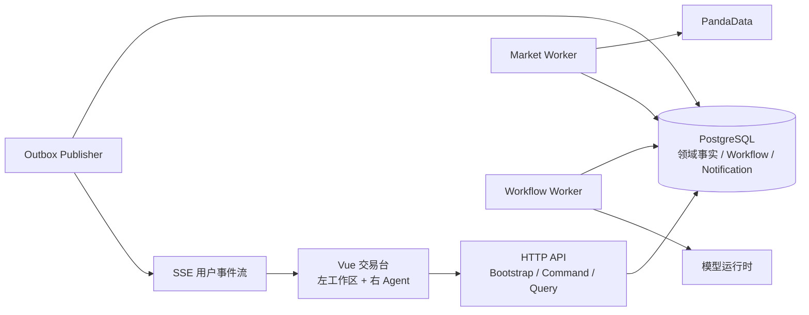

# Finance-God Agent 主控交易台：用户旅程、现状审计与 Phase 规划

> 日期：2026-07-25  
> 范围：当前仓库后端、生产交易台和隔离原型  
> 目标：把“左侧交易工作区 + 右侧主控 Agent + 服务端行情/工作流/提醒”落成可运行、可观测、可审计的纵向阶段。

## 1. 结论

当前项目是浏览器客户端 + API/Worker 服务端的 C/S 逻辑架构，以 Web 形式交付；仓库并非“只有客户端”。后端已经具备：

- FastAPI 入口与挂载的 Starlette Finance API；
- PandaData 标准化行情、质量门和只读市场事实接口；
- 30 秒默认间隔的服务端行情轮询、最新快照表和全局涨跌告警表；
- 仿真账户、持仓、草稿、订单、成交、账本、授权、交易计划和证据；
- 自选、研究候选、用户通知及偏好；
- 持久 `WorkflowRun` 的创建、幂等、事件、审计、Outbox、查询和真实进度快照；
- 一次性 Multi-Agent 研究接口。

尚未闭环的是：行情历史与采集运行可观测性、用户级行情提醒与实时推送、工作流租约/取消/事件流、持久对话、UI 动作持久审计，以及生产客户端对 Desk Bootstrap 和语义动作回执的完整接入。

本轮工作区中的后续实现已经补上第一版 `GET /api/desk/bootstrap`、`POST /api/desk/ui-actions`、进程内/独立 Workflow Worker、`/notifications/history`，并让交易台意图经 `/workflows/desk` 进入持久 `WorkflowRun`。因此下述 Phase 是能力演进顺序，不应再把 P1/P4 全部描述为“从零开始”；每个 Phase 的剩余项以完成门为准。

这是结构性改造。应继续使用一个代码仓库和一套领域模型，运行时拆成 **API + Market Worker + Workflow Worker + Outbox/SSE Publisher**；当前阶段不拆微服务，也不建立第三套任务状态。

## 2. 目标边界与核心不变量

1. PandaData 凭据永不进入浏览器。
2. 行情 observation 是事实，latest 只是可重建投影；失败不得改写为新鲜或虚构行情。
3. 正式任务只有一个 `WorkflowRun`；聊天消息只引用它。
4. Agent 只执行服务端下发、客户端校验的版本化语义动作，不接触 DOM 选择器、坐标或任意脚本。
5. Agent 可导航、筛选、选标的、填写未提交草稿和启动研究工作流；不能提交/撤销订单、划转资金、改设置或写账本。
6. 原始用户设置和问卷不进入 Agent；只提供获准用途的最小、脱敏、版本化适当性投影。
7. “关闭 Toast”“标记已读”“处理完成”是三个状态，不互相替代；记录必须可回看。
8. 重大行情由确定性、版本化规则检测；AI 只解释已经成立的事件。
9. 行情、账户、工作流和提醒的失败均显式可见。

## 3. 当前后端事实矩阵

| 能力 | 代码证据 | 当前状态 | 目标差距 |
|---|---|---|---|
| API 组合 | `backend/app/main.py`、`backend/server.py` | `/api/v1` FastAPI 与 `/api` Starlette 均可挂载 | 成功包络、错误、OpenAPI 和版本策略不统一 |
| PandaData 行情 | `market_data/*`、`server.py` 的 `/market/*` | 有 quotes、overview、bars、财报披露、融资余额、标的主数据和质量错误 | 没有统一 Desk View；实时成功仍依赖运行环境与凭据 |
| 服务端行情轮询 | `application/market_poller.py`、`server._start_market_poller()` | 默认 30 秒；有界 A 股池；API lifespan 内常驻 | 与 API 进程耦合；横向扩容重复轮询；无交易日历、租约、分层频率 |
| 行情存储 | `market_snapshots`、`market_alerts` | 保存每标的最新快照和全局告警 | 无 observation 历史、fetch run、schedule、规则版本和保留策略 |
| 异动检测 | `market_data/monitor.py` | 按相对昨收涨跌幅跨越 5%/9% 阈值检测，避免持续重复 | 不是相邻采样跳变；无成交量/断流/质量规则、冷却/迟滞、用户关联 |
| 仿真交易 | `api/simulation.py`、`execution/*`、账本与持久化 | 账户、草稿、复核、确认、提交、订单、成交和组合较完整 | 仍需用服务端行情版本完成端到端引用价与撮合证据验证 |
| 自选与候选 | `api/workspace_routes.py`、`candidate_service.py` | 自选 CRUD、忽略候选、确定性维度解释 | 固定 8 只 A 股池；未消费适当性投影；方向分类存在产品语义问题 |
| 工作流创建/读取 | `api/workflow_routes.py` | `POST /workflows`、`POST /workflows/desk`、GET Run、GET progress；Bearer + 幂等 | 已有 Worker 推进；仍无公开取消、事件流和多 Worker 租约 |
| 工作流持久化 | `workflow_runs/events/audit/outbox/execution_audit` | 幂等、CAS、追加审计与 Outbox 已存在 | 无常驻 Worker、Outbox 发布器、Artifact 查询和恢复运维面 |
| Agent | `api/agent_routes.py`、`api/desk_routes.py`、`api/workflow_routes.py` | 一次性 research Run；交易台意图路由到 WorkflowRun；Bootstrap 返回快捷指令与动作目录 | 无持久对话；UI 动作回执尚未形成客户端应用与持久审计闭环 |
| 画像 | `server._investor_profile_context()` | 读取最新画像和推荐方向 | 投影过宽；读取失败静默为空；缺少同意、用途和投影版本 |
| 通知 | workspace `notifications`、history、receipt、preference | 未读、历史、标记已读和偏好存在 | 与 `market_alerts` 分裂；无关闭/处理、SSE 和投递状态 |
| 用户设置 | 画像/设置 API 与生产“我的”面板 | 用户可本人读写 | 需要在服务端 capability 发现和审计层显式排除，而不只靠 UI 隐藏 |
| Desk Bootstrap | `api/desk_routes.py` | 已返回脱敏投影、工作区、三条指令、动作目录、动态能力和 context_version | 生产客户端尚未完全切换到单次初始化；缺少组合式 Desk View 数据 |

### 当前行情监控应如何定位

现有 `MarketPoller` 是可运行的 Phase 1 骨架，不是最终“重大行情自动推送”：

- 它在 API 进程启动，不是独立 Worker；
- `market_snapshots` 只保留最新值，无法回放规则；
- `market_alerts` 是全局日志，没有用户、已读、关闭或处理状态；
- `/api/market/alerts` 是拉取接口，没有 SSE；
- “大幅变动”实际指相对昨收涨跌幅跨阈值，不是相邻两次轮询的价格突变；
- 每轮成功数、失败数、耗时、上游错误和下次计划没有持久化运行记录。

### 当前工作流应如何定位

当前公开接口会可靠地创建并读取 Run，`progress` 只报告已持久化节点产物数，不伪造百分比。进程内或独立 Worker 已能用 `queued → running` CAS 领取并执行受支持工作流；“创建成功”仍只表示已入队，客户端必须继续观察服务端状态。当前缺口是租约续租、公开取消、事件流和多 Worker `SKIP LOCKED`。

## 4. 原需求中的不合理点与修正

| 原表述 | 问题 | 修正决定 |
|---|---|---|
| “工作流维护一个存储信息的数据表” | 把业务事实、编排、通知和产物混在一表会形成重复真相源 | 领域表保存事实；工作流只保存状态、输入版本、节点产物引用和审计 |
| “行情间隔可以较长”且“重大变动自动推送” | 没有检测延迟 SLA，无法同时验收 | 分层采集并公开最坏检测延迟；持仓/自选快于普通标的 |
| 初次“推荐购入股票” | 画像不足时容易成为无依据的个性化买入指令 | 改为“可研究候选”，附适配理由、反方证据、未知项、版本与下一步 |
| 自动弹出聊天气泡 | 与常驻右栏和无悬浮机器人规范冲突 | 在对话线程中初始化说明，输入框上方提供恰好三条轻量快捷指令 |
| 快捷指令既写“输入框上方”又写“输入框下方” | 空间约束互相冲突 | 统一为输入框上方，贴近输入区，无卡片、描边或阴影 |
| “每个按钮/表单都可被 Agent 获取” | DOM 暴露脆弱、不可授权、不可审计 | 页面发布 `UiActionDescriptor` 白名单；Agent 返回语义命令 |
| Agent “自主执行任务” | 未定义自治等级，可能越过交易确认 | L0 解释；L1 导航筛选；L2 填草稿；L3 启动研究；订单提交永久本人确认 |
| 用户设置不被 Agent 获取但需个性化 | 原始设置不可读与画像使用存在冲突 | 服务端生成最小 `SuitabilityProfileProjection`，带用途、同意和版本 |
| 提醒自动关闭 | 重大风险可能被自动隐藏 | 信息 Toast 可定时隐藏；高优先级保持；隐藏不等于已读/处理 |
| “钱包” | 容易被理解为真实资金托管 | 当前只称“仿真资金”，真实钱包需单独合规与托管项目 |
| 所有导航都放左侧 | 会把交易记录/钱包与高频任务混在一级工作区 | 高频工作区保留总览/持仓/自选/交易；钱包、记录、设置归入“我的” |
| Agent 直接完成推荐和交易 | 研究、适当性与执行混成一个不可审计动作 | 候选 → 研究 → 计划 → 草稿 → 复核 → 本人提交，阶段间引用版本化产物 |

## 5. 信息架构裁决

### 顶部

- 左：`FINANCE GOD` 字标和产品副标。
- 右：提醒、我的。
- “我的”包含画像、仿真资金、交易记录和设置；整个区域不进入 Agent 动作目录。

### 左侧高频工作区

1. 总览：真实行情、融资余额事实、公司披露事实。
2. 持仓：仿真账户与仓位，引用真实行情估值。
3. 自选：分组、标的、可研究候选。
4. 交易：仿真草稿、复核、风险确认、本人提交。

### 右侧 Agent

- 常驻并默认展开，绑定当前工作区、标的、对象版本和可用能力。
- 三条快捷指令由服务端优先返回；合同未上线前可用确定性本地映射，但不得宣称个性化 AI。
- 正式任务引用 `WorkflowRun`；运行中展开，终态默认折叠并可追溯。
- 只接收和返回语义动作，不持有设置、凭据或提交能力。

## 6. 用户旅程

### J1：首次进入、没有仿真交易

1. 客户端认证后请求 `GET /api/desk/bootstrap`。
2. 服务端返回最小画像投影、工作区默认值、行情版本、恰好三条快捷指令和动作目录。
3. 左侧显示总览；没有行情时明确显示错误/等待，不展示样例价格。
4. 右侧线程显示初始化说明；快捷指令包含“生成可研究候选”，不写“立即买入”。
5. 用户触发候选研究，服务端创建 `WorkflowRun`；右侧显示 queued/running/终态。
6. 完成产物给出理由、风险、反方证据、未知项和下一步；不会自动建单。

**关键观测**：bootstrap 延迟、画像投影版本、行情 provider_time/freshness、WorkflowRun 状态和候选证据引用。

### J2：返回用户、已有仿真持仓

1. Bootstrap 选择持仓或用户上次工作区，并携带组合版本。
2. 左侧显示仿真现金、仓位和引用行情；行情不可用时市值/浮盈为“行情不可用”。
3. 三条快捷指令变为持仓分析、集中度/压力测试和当前标的研究。
4. 用户发起压力测试；Agent 创建工作流并只消费组合投影与行情版本。
5. 用户切换标的或组合变化导致 `context_version` 递增；旧动作回执为 `stale_context`。

**关键观测**：portfolio_version、market_version、context_version、拒绝旧动作次数。

### J3：从自然语言控制左侧

1. 用户输入“打开交易并把数量填成 200”。
2. Agent 解析为两个动作：`navigate_section(trading)`、`fill_order_quantity(200)`。
3. 客户端校验 action ID、参数 schema、descriptor_version 和 context_version。
4. 应用成功后回传 `applied`；左侧切到交易并只填写未提交草稿。
5. “帮我直接下单/撤单/打开设置”返回 `rejected`，并说明本人操作路径。

**关键观测**：action_id、descriptor_version、context_version、applied/rejected/stale_context、审计 actor。

### J4：重大行情提醒

1. Market Worker 按计划拉取 PandaData，写 observation 与 fetch run。
2. 确定性规则对 observation 窗口检测价格跳变、量能异常、断流或质量降级。
3. 告警事件按持仓、自选和当前研究对象映射到用户通知。
4. Outbox/SSE 推送；客户端显示 Toast，同时写入提醒历史。
5. 普通信息 Toast 可定时隐藏；高优先级保持。用户可分别关闭、已读和处理。
6. 用户点击提醒后左侧定位标的，右侧三条指令切换为事件影响、持仓影响和证据核查。

**关键观测**：fetch_run_id、rule_version、dedupe_key、detected_at、delivered_at、read_at、handled_at。

### J5：从研究到本人提交

1. 候选研究完成，用户明确选择“生成交易计划”。
2. 工作流引用候选产物、画像投影、行情版本和授权版本。
3. 计划可转为未提交草稿；Agent 可填字段，但不能确认风险或提交。
4. 服务端重新绑定有效行情引用价并执行确定性风险检查。
5. 用户本人确认软风险和不可编辑摘要，再提交仿真订单。
6. 订单/成交进入交易记录和提醒，Agent 仅做解释。

**关键观测**：artifact refs、risk rule version、summary hash、idempotency key、user confirmation actor。

### J6：设置与隐私

1. 用户从“我的 → 设置”进入本人控制面。
2. 设置页面不发布 Agent context，也不出现在 action descriptors。
3. 保存后服务端可异步生成新的适当性投影；Agent 只在下次授权上下文刷新时看到投影版本变化。
4. 原始问卷、收入、凭据和私密证据不进入聊天、工作流 scope 或 UI 动作审计。

### J7：故障与恢复

- 行情失败：保留最后成功 observation 并标 stale；显示错误码和最后成功时间。
- 工作流长期 queued：显示“等待执行器”，不模拟步骤。
- Worker 失败：租约到期后恢复或进入 attention_required/failed，并保留节点产物。
- SSE 断开：按 cursor 重连；历史 API 补齐遗漏事件。
- 上下文已变化：动作返回 stale_context，Agent 重新读取当前目录再规划。

## 7. 目标运行架构



首阶段可用 PostgreSQL `FOR UPDATE SKIP LOCKED` + 租约，不要求立刻引入 Kafka/Redis。只有吞吐和多消费者指标证明需要时再引入消息系统。

## 8. 建议数据模型

| 表/投影 | 关键字段 | 作用 |
|---|---|---|
| `market_observations` | instrument、provider_time、retrieved_at、frequency、price/volume、quality、payload_hash | 追加保存行情事实 |
| `market_latest` | instrument、observation_id、freshness、updated_at | 快速读取，可重建 |
| `market_poll_schedules` | scope、interval、calendar、enabled、next_due_at | 分层采集策略 |
| `market_fetch_runs` | schedule_id、started/ended、counts、latency、status、error_code | 每轮可观测记录 |
| `alert_rule_versions` | key、version、window、thresholds、cooldown、enabled | 可回放规则 |
| `market_alert_events` | rule_version、observation_refs、severity、dedupe_key、detected_at | 不可变异常事实 |
| `notification_deliveries` | notification_id、channel、attempt、status、delivered_at、error | 推送投递状态 |
| `agent_conversations/messages` | owner、context_version、role、content、workflow_run_id | 对话和任务引用 |
| `ui_action_audit` | command_id、action_id、descriptor_version、args、result、context_version | 左右联动审计 |

现有工作流、workspace、仿真交易和账本表继续复用，不复制同义状态。

## 9. 关键 API 合同

### Desk Bootstrap

`GET /api/desk/bootstrap`

```json
{
  "data": {
    "context": {
      "version": "desk/42",
      "section": "portfolio",
      "selected_symbol": "000001.SZ"
    },
    "profile": {
      "projection_version": "3",
      "risk_level": "moderate",
      "completeness": 0.86
    },
    "quick_commands": [
      {
        "id": "portfolio-risk",
        "label": "分析当前仿真持仓风险",
        "workflow_key": "portfolio_stress"
      }
    ],
    "ui_action_descriptor": {
      "version": "desk-actions/v1",
      "actions": [
        {
          "id": "navigate_section",
          "scope": "workspace",
          "mutation": "ui_only"
        }
      ]
    }
  }
}
```

### UI 动作

```json
{
  "command_id": "uicmd-...",
  "context_version": "desk/42",
  "descriptor_version": "desk-actions/v1",
  "action_id": "fill_order_quantity",
  "parameters": { "quantity": "200" }
}
```

客户端回执只能是 `applied | rejected | stale_context`。动作目录永不包含设置、最终确认、提交、撤单、资金划转、凭据或任意 DOM/CSS 选择器。

### 事件流

`GET /api/events?cursor=...` 使用 SSE，事件至少包含：

- `event_id`、`cursor`、`event_type`、`occurred_at`；
- `workflow_run_id` 或 `notification_id`；
- `fact_version`；
- 仅属于当前认证用户的投影。

断线后按 cursor 恢复；客户端不可把 SSE 丢失解释为业务完成。

## 10. 默认行情采集策略

在产品确认 SLA 前，以下为可配置默认值：

| 范围 | 开市采集 | 闭市采集 | 默认最坏检测延迟 |
|---|---:|---:|---:|
| 当前标的、持仓、自选 | 60 秒 | 15 分钟或暂停 | 75 秒 |
| 活跃研究候选 | 5 分钟 | 30 分钟 | 6 分钟 |
| 其他已收录标的 | 15 分钟 | 每日校验 | 16 分钟 |

调度必须读取交易日历，限制并发，记录实际频率和上游时点。页面显示实际频率，而不是配置值。重大行情规则至少覆盖：

- 窗口价格跳变；
- 成交量异常；
- 数据断流；
- 质量降级；
- 冷却、迟滞和稳定 `dedupe_key`。

## 11. 可运行、可观测的 Phase

### Phase 0：基线与架构决策

**运行状态**：现有产品保持可运行。  
**交付**：API/DB ADR、自治等级、行情检测 SLA、当前测试与性能基线。  
**可观测**：`/live`、`/ready`、PandaData 成功率/延迟、前后端测试报告。  
**完成门**：明确不允许 Agent 提交/撤单；确认提醒状态语义；确认采集层级和延迟。

### Phase 1：统一合同与 Desk Bootstrap

**运行状态**：客户端可一次加载当前工作区；旧接口继续兼容。  
**交付**：统一包络、`DeskBootstrapView`、最小画像投影、capability/action descriptor v1。  
**可观测**：bootstrap p50/p95、错误码、投影版本、字段级契约测试。  
**完成门**：设置/凭据不出现在 bootstrap；所有金额字符串化；context_version 可验证。

### Phase 2：行情采集纵向闭环

**运行状态**：Market Worker 独立运行，API 只读 DB；当前 `MarketPoller` 迁出 API lifespan。  
**交付**：observation/latest/schedule/fetch_run、交易日历、租约、保留策略。  
**可观测**：每轮成功/失败/空结果、延迟、落后量、last_success、next_due。  
**完成门**：重启不丢最新事实；双 Worker 不重复采集；故障显示 stale，绝不伪造。

### Phase 3：重大行情与提醒闭环

**运行状态**：重大事件可落库、映射用户、推送并在历史中查询。  
**交付**：规则版本、事件、用户通知、delivery、历史分页、关闭/已读/处理、SSE cursor。  
**可观测**：检测延迟、去重命中、投递延迟、重连补发、未处理高优先级数量。  
**完成门**：普通 Toast 自动隐藏不改变 read 状态；P0/P1 不自动消失；跨用户隔离测试通过。

### Phase 4：工作流 Worker 与产物闭环

**运行状态**：创建的 Run 可被领取并走到真实终态。  
**交付**：领取/租约/续租、节点执行、重试、取消、恢复、Artifact 查询、事件投影。  
**可观测**：queue age、运行时长、节点耗时、重试次数、租约恢复、终态分布。  
**完成门**：进程终止后可恢复；相同幂等请求只创建一个 Run；浏览器不模拟状态。

### Phase 5：Agent 会话与任务路由

**运行状态**：右侧会话持久存在；研究意图统一创建 `WorkflowRun`。  
**交付**：conversation/message、意图路由、三条服务端快捷指令、Run 引用、研究候选产物。  
**可观测**：路由结果、workflow_key、引用证据、画像投影版本、拒绝原因。  
**完成门**：移除第三套任务状态；画像缺失/失败显式 degraded；证据落库失败阻断需要证据的下游。

### Phase 6：Agent 控制左侧

**运行状态**：Agent 可导航、筛选、选标的和填未提交草稿。  
**交付**：动作目录、参数 schema、版本校验、回执、审计与 stale context 重规划。  
**可观测**：applied/rejected/stale_context、动作延迟、拒绝原因、descriptor 版本。  
**完成门**：没有 DOM/坐标动作；设置和交易提交永不在目录；所有动作均有回执。

### Phase 7：完整交易台旅程

**运行状态**：总览、持仓、自选、交易与右侧 Agent 端到端联动。  
**交付**：候选→研究→计划→草稿→复核→本人提交；“我的”和提醒完整。  
**可观测**：每段漏斗、版本冲突、风险拒绝、用户确认 actor、数据 freshness。  
**完成门**：行情失败不显示假市值；所有账户事实标仿真；最终提交需要用户手势和不可编辑摘要。

### Phase 8：生产加固与渐进发布

**运行状态**：按用户/组织灰度，旧路径可回退。  
**交付**：容量、灾备、审计导出、告警 Runbook、SLO、迁移/回滚、隐私和安全测试。  
**可观测**：SLO、错误预算、队列积压、数据库增长、SSE 连接数、跨租户防护。  
**完成门**：故障演练、备份恢复、权限测试、真实 PandaData smoke、无障碍与 1440/1024 视觉验收通过。

## 12. 需要产品确认的四个问题

这些问题不阻塞原型，但会阻塞 Phase 2–3 的验收口径：

1. “重大行情”的最坏可接受检测延迟是 1 分钟、5 分钟还是 15 分钟？
2. 覆盖范围仅为持仓/自选/当前标的，还是包含全 A 股？
3. 高优先级提醒除站内外，是否需要邮件、短信或移动推送？
4. Agent 自治上限是否确认停在“填未提交草稿”，最终提交与撤单永久由用户本人执行？

## 13. 当前实施优先级

不要先继续增加前端面板或更多 Agent。下一步应依次完成：**P0 决策 → P1 Bootstrap/投影 → P2 独立 Market Worker → P3 用户提醒 → P4 Workflow Worker → P5/P6 Agent 联动**。这条顺序先补事实与执行闭环，再开放更高自治，能避免界面先展示出后端并不存在的能力。
