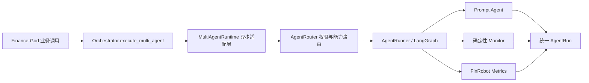

# Finance-God Multi-Agent 技术说明

## 架构

Finance-God 使用 `verifolio-research-runtime 0.2.0` 作为唯一 Multi-Agent 内核，不在
项目内重复实现 Agent 注册、路由或 LangGraph 图构建。



实现位置：

- `backend/finance_god/orchestration/orchestrator.py`：业务编排入口与依赖注入；
- `backend/finance_god/orchestration/multi_agent.py`：同步 Runner 到异步应用的边界适配；
- `backend/vendor/verifolio-unified-agents-0.2.0/`：固定版本源码、上游依据与许可证；
- `backend/tests/test_multi_agent.py`：集成契约与兼容性测试。

运行时通过 `backend/requirements.txt` 的本地 editable 路径安装。该方式不是开发期临时
配置，而是为了保留包内 FinRobot Metrics 适配器所依赖的相对源码路径。

## 请求与路由

所有调用使用包提供的 `AgentRequest`，返回 `AgentRun`。自动路由以
`task_type`、`asset_kind` 和 `tags` 匹配 Agent，并继续检查：

1. 当前 `profile` 是否允许该 Agent；
2. `available_resources` 是否包含所需资源；
3. `authorized_actions` 是否包含逐次授权；
4. 已选 Agent 数量是否超过 `max_agents`。

也可用 `requested_agent_ids` 点名 Agent。点名只跳过能力匹配，不绕过权限、资源和授权
检查。

## 执行模式

`MultiAgentRuntime.from_environment(max_concurrency=N)` 将并发上限传给包内
`AgentRunner`。`N=1` 时，Agent 顺序执行并能看到前序结果；`N>1` 时，各 Agent 独立并发
执行，结果仍按路由计划排序。

包内 Runner 是同步 API，因此适配层使用 `asyncio.to_thread`，避免在 FastAPI 或其他异步
宿主中阻塞事件循环。

## 配置与失败边界

Prompt Agent 通过环境变量配置 OpenAI Responses-compatible 模型：

```dotenv
ARK_API_KEY=
ARK_BASE_URL=https://api.openai.com/v1
ARK_MODEL=
```

失败会原样暴露，不创建模拟成功结果：

- 缺少模型配置时，构建运行时失败；
- Prompt Agent 缺少证据或返回无效 JSON 时，执行失败；
- 未满足资源、配置或逐次授权时，路由失败；
- Finance-God 未注入 Multi-Agent Runtime 时，调用入口失败。

Prompt Agent 的 `proposed_actions` 只是待审核建议，不代表文件、账户、仓库或交易状态已经
改变。FMP 和 PandaData 适配器只在构建运行时传入 `enable_finrobot_metrics=True` 或
`enable_panda_data=True` 后启用，且仍需满足请求级资源门禁。

## 版本升级

升级分发包时，应同时：

1. 替换 `backend/vendor/` 中的版本目录；
2. 更新 `backend/requirements.txt` 的本地路径与依赖范围；
3. 核对运行时的 `AgentRequest`、`AgentRun` 和环境变量契约；
4. 运行项目集成测试与上游包的目录校验。
