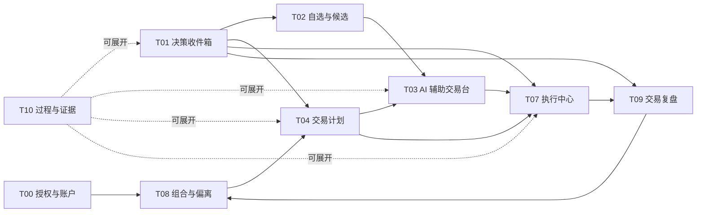

# Finance-God 前端设计文档索引

> 文档类型：参考 / Reference  
> 目标读者：产品、设计、前端、后端与测试人员  
> 强制前端规范：[前端统一设计规范](01_前端统一设计规范.md)  
> 工程边界：[前后端职责与数据合同](02_前后端职责与数据合同.md)  
> 设计简报：[前端设计简报模板](templates/前端设计简报模板.md)  
> 验收模板：[前端设计验收模板](templates/前端设计验收模板.md)  
> 本次文档验收：[2026-07-24 前端文档统一验收](acceptance/2026-07-24_前端文档统一验收.md)

## 文档定位

本目录是 Finance-God 前端设计的唯一入口。规范只定义一次：全局交互和视觉进入
`01_前端统一设计规范.md`，工程职责和数据合同进入 `02_前后端职责与数据合同.md`，
路由差异进入 `pages/`，验证结果使用统一模板。

页面设计以 [前端统一设计规范](01_前端统一设计规范.md) 为强制基准：
每个页面都说明页面定位、功能模块、用户操作、AI 处理、关键状态、AI 边界和验收标准。

页面布局的研究过程见 [页面布局辩论与裁决](../research/frontend/页面布局辩论与裁决.md)。其中仍有效的
结论已经并入强制前端规范；研究记录本身不再定义当前断点或导航。

开源项目调研、采用判断和许可证边界见
[开源项目与页面形态参考](../research/frontend/开源项目参考与页面补充.md)。该文档只解释
设计来源，不新增现行页面要求。

页面结构、视觉、文案、PandaData、桌面工作区和 Agent 验收统一遵循
[前端统一设计规范](01_前端统一设计规范.md)。
页面复杂度预算、功能裁剪方法、前后端职责和标准化接口边界见
[前后端职责与数据合同](02_前后端职责与数据合同.md)。

## 页面范围

| 编号 | 页面 | 主要任务 | 与 AI 辅助交易台的关系 | 文档 |
| --- | --- | --- | --- | --- |
| T00 | 交易授权与账户控制 | 决定账户、资产和 Agent 可以做什么 | 为交易台提供有效授权、账户和硬边界 | [查看](pages/T00_交易授权与账户控制.md) |
| T01 | 交易总览与决策收件箱 | 知道当前是否安全、需要处理什么 | 汇总交易台、计划和执行中心的待办 | [查看](pages/T01_交易总览与决策收件箱.md) |
| T02 | 自选与候选 | 管理关注资产并研究组合相关候选 | 选择标的后进入交易台 | [查看](pages/T02_自选与候选.md) |
| T03 | AI 辅助交易台 | 研究单个标的并完成手动订单草稿与确认 | 核心标的交易工作区 | [查看](pages/T03_AI辅助交易台.md) |
| T04 | 交易计划详情 | 理解为什么调整组合以及如何执行 | 可将单个标的送入交易台，或生成批次订单 | [查看](pages/T04_交易计划详情.md) |
| T07 | 执行中心 | 跟踪全账户订单、成交、撤单和异常 | 接收交易台提交的订单事实 | [查看](pages/T07_执行中心.md) |
| T08 | 组合与偏离 | 理解当前持仓、目标组合和风险差异 | 从组合偏离创建交易计划 | [查看](pages/T08_组合与偏离.md) |
| T09 | 交易复盘 | 比较计划、执行和组合结果 | 使用交易台与执行中心的历史事实 | [查看](pages/T09_交易复盘.md) |
| T10 | 过程与证据 | 追溯 AI、数据、规则和版本 | 作为各交易页面的证据抽屉或高级页 | [查看](pages/T10_过程与证据.md) |
T05“订单草稿”和 T06“订单复核”是 T03 AI 辅助交易台内部的逻辑区域和覆盖层，不单独创建一级页面。
移动端不在当前范围内；当前只支持 1024 px 及以上桌面端。该约束只在强制前端规范中维护，
不保留独立移动页面规格。

## 主流程

## 跨页核心对象

| 对象 | 创建位置 | 主要使用页面 | 单一事实源 |
| --- | --- | --- | --- |
| `InvestmentMandate` | T00 | T01、T03、T04、T08 | 授权服务 |
| `AccountConnection` | T00 | T01、T03、T07 | 账户与经纪商连接服务 |
| `PortfolioSnapshot` | T08 | T01、T02、T03、T04、T09 | 组合服务 |
| `ResearchArtifact` | T03/T10 | T02、T03、T04、T09 | 研究产物存储 |
| `ResearchArtifact.debate` | T03/T04/T10 | T03、T04、T09、T10 | 研究产物存储 |
| `DataProvenance` | 数据接入过程 | T02、T03、T04、T08、T10 | 数据接入服务 |
| `ComputeArtifact` | 确定性计算过程 | T03、T04、T08、T09、T10 | 确定性计算服务 |
| `AgentRun` | Agent 运行时 | T01、T03、T04、T10 | Agent 运行时 |
| `BacktestSnapshot` | T04 | T04、T09、T10 | 回测服务 |
| `TradePlan` | T04；手动计划可由 T03 创建 | T01、T03、T04、T07、T09 | 交易计划服务 |
| `OrderDraft` | T03/T04 | T03、T04 | 草稿服务 |
| `RiskCheckResult` | 订单预检与提交校验 | T03、T04、T07 | 风控服务 |
| `Order` | 执行服务 | T01、T03、T07、T09 | 执行服务 |
| `Fill` | 仿真撮合或经纪商回报 | T03、T07、T08、T09 | 执行服务 |
| `ConnectionHealth` | 账户连接与执行事件流 | T00、T01、T03、T07 | 账户连接服务 |
| `ReviewRecord` | T09 | T01、T04、T09 | 复盘服务 |
| `JournalEntry` | T09 | T09 | 复盘服务 |

任何页面都不得复制并独立修改这些对象。页面只提交命令，事实状态由所属服务返回。

## 全局页面规则

1. 1440 px 使用顶部一级导航、工作区标签、紧凑分隔面板和 12–16 px 间距；不使用大型左侧全局导航。
2. 顶部持续显示仿真账户、PandaData 行情连接、数据时点和 AI 入口。
3. AI 建议、规则校验和执行事实使用不同标签与视觉层级。
4. 同一页面只设置一个视觉主操作；阻断时不显示可提交主操作。
5. 行情、授权、组合或校验版本变化后，旧结果必须明确过期。
6. “提交成功”只表示请求已发送；订单受理、成交和撤销必须等待执行回报。
7. AI 不可用时显式显示失败，不生成默认建议，不伪造成功。
8. 颜色不是区分买卖、风险和状态的唯一方式。
9. 任一交易事实都能展开到 T10 查看来源、版本、规则与事件。
10. 一个页面不得出现三个互相竞争的纵向滚动轴；1024 px 保留完整桌面任务，低于 1024 px 显示桌面端访问提示。

## 通用状态词

| 对象 | 统一状态 |
| --- | --- |
| AI 任务 | 排队中、分析中、数据不足、来源冲突、已完成、已过期、失败 |
| 交易计划 | 草稿、待审阅、需修改、已确认、执行中、部分完成、已完成、已取消、已失效 |
| 风控校验 | 检查中、通过、需确认、阻断、已过期 |
| 订单 | 草稿、提交中、状态未知、已受理、部分成交、已成交、撤单中、已撤、已拒、已过期 |
| 账户连接 | 未连接、连接中、已连接、需重新授权、只读、暂停、异常 |

## 验收基线

- 用户能在任一页面识别当前账户是仿真还是实盘，正确率 100%。
- 行情过期、授权失效或硬风控阻断时不能提交订单。
- 任一订单可追溯到用户确认、授权版本、交易计划、订单草稿和校验结果。
- 页面刷新和跨端切换不会创建第二份计划或订单。
- 部分成交、撤单中、拒单和状态未知均有独立状态。
- 任一 AI 结论都能找到数据时点、来源、反方证据、未知项和失效条件。
