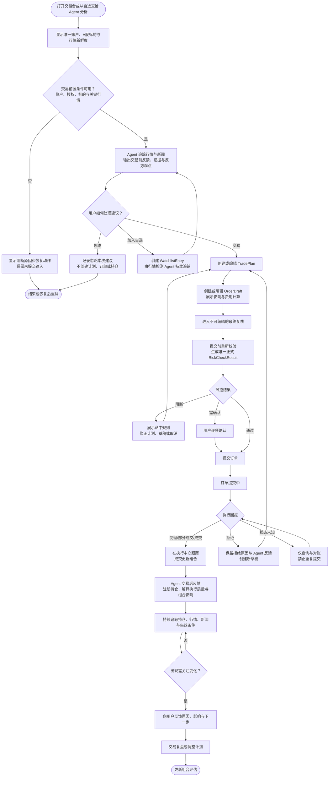
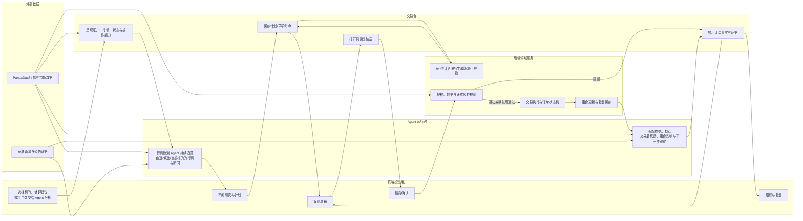
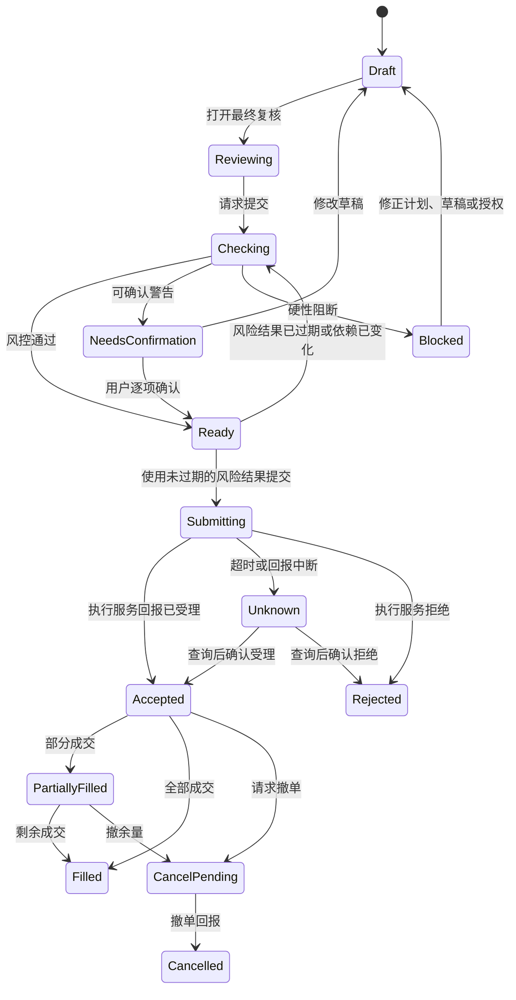
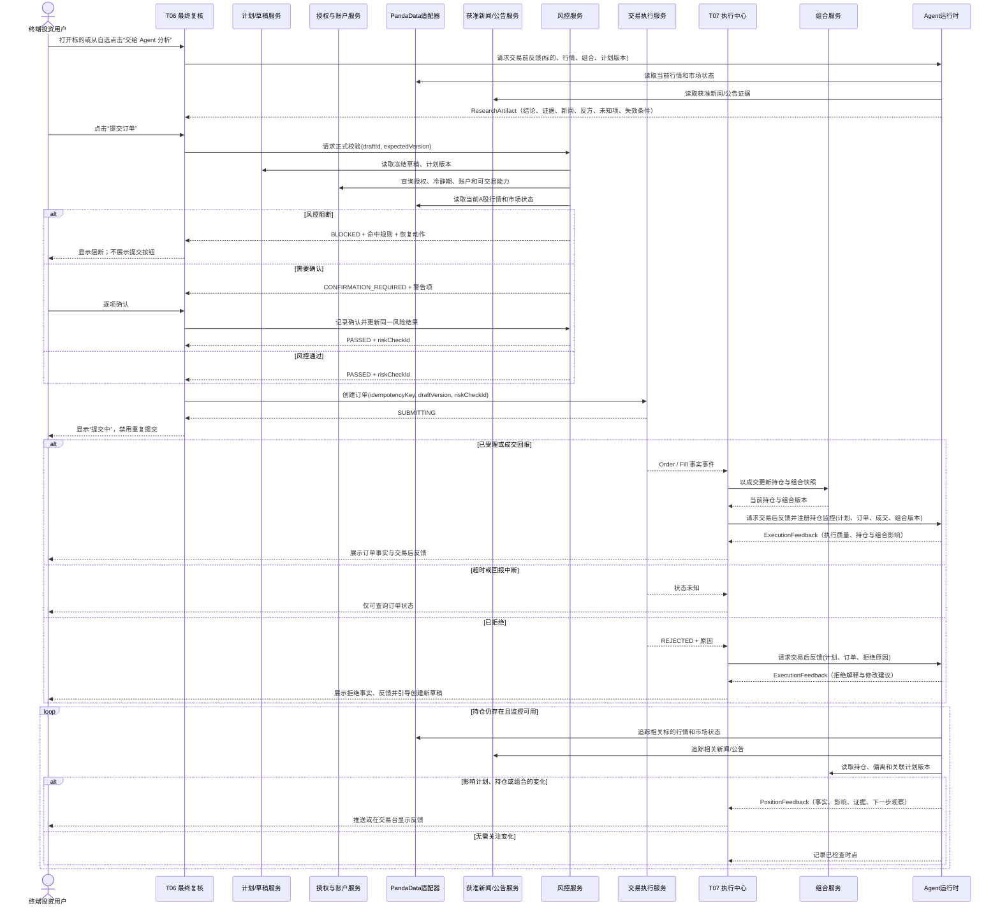
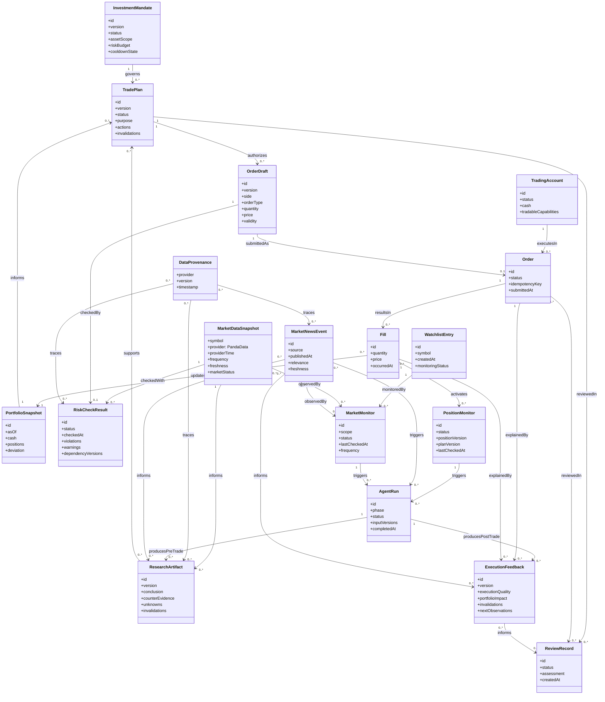

# Finance-God 交易台用户旅程与 UML

> 状态：已确认的交易台范围基线
>
> 面向：产品、研发、量化、风控、测试
> 目的：统一用户旅程、系统责任、关键状态和验收口径

## 1. 范围与决策

本文件只描述交易台旅程：用户已经启用唯一交易账户并具备有效投资授权后，完成 A 股标的研究、创建计划、订单复核、交易执行和复盘的闭环。开启模拟交易只决定资金与成交由内部模拟执行；交易台的任务、操作和反馈与正常交易台一致。

| 决策项 | 已确认口径 |
| --- | --- |
| 产品范围 | 交易台子旅程；不包含建档、画像、首次授权和持仓导入 |
| 首发资产 | A 股 |
| 账户模型 | 当前仅一个用户、一个启用账户；不设计账户选择、账户切换或多用户协作 |
| 交易模式 | 开启模拟交易后，资金、持仓、订单、成交与复盘由内部模拟执行；页面按正常交易台呈现，不反复以“模拟”作为路径或按钮文案 |
| 行情 | PandaData 是唯一市场数据来源，必须展示来源、供应商时点、频率和新鲜度 |
| A 股规则 | 内部模拟执行按交易日历、涨跌停、最小交易单位、费用和结算规则校验 |
| 正式风控 | 仅在提交前形成一份正式 `RiskCheckResult`；此前的影响、费用与约束计算不称为正式风控 |
| 冷静期 | 禁止新增风险；允许降低风险的卖出或赎回 |
| Agent 反馈 | 持续追踪当前标的/关注标的的行情与相关新闻；交易前提供研究与计划反馈，订单事件后追踪持仓并提供执行、组合影响和复盘反馈；全程只读且不改变交易事实 |
| 图表交付 | 主旅程活动图、跨角色泳道图、订单状态机、提交时序图、领域对象类图 |

### 1.1 非本次范围

- 用户画像、投资授权书创建、账户开户或经纪商实盘接入；
- 多账户、账户切换、多用户协作、账户间资金划转；
- 港股、美股、基金、期权、融资融券、做空和复杂订单；
- 自动下单、AI 自动确认订单、移动端交易流程；
- 内部运营、合规和技术支持人员的完整操作台。

## 2. 参与者、边界与不变量

### 2.1 参与者和系统责任

| 参与者/服务 | 负责 | 不负责 |
| --- | --- | --- |
| 终端投资用户 | 在唯一账户内选择标的、审阅反馈、编辑计划和草稿、确认警告、最终提交、撤单与复盘 | 绕过授权、风控或订单状态机 |
| 交易台前端 | 呈现页面状态、收集命令、显示数据新鲜度和错误 | 计算交易事实、保存权限、推断订单结果 |
| PandaData 适配器 | 提供标准化 A 股行情和元数据 | 向浏览器暴露凭据、伪造缺失字段 |
| Agent/研究服务 | 跟踪范围内标的的行情和获准新闻/公告；在交易前形成带证据、反方观点、未知项和失效条件的反馈；成交后追踪持仓、执行质量、组合影响、偏离与失效条件 | 创建或提交订单，修改授权、持仓、成交或正式风控结果 |
| 授权与账户服务 | 返回唯一账户的可用状态、授权、冷静期和可交易能力 | 由页面本地状态替代 |
| 计划与草稿服务 | 管理版本化 `TradePlan`、`OrderDraft` | 产生订单或成交事实 |
| 风控服务 | 在提交前重新校验并生成唯一正式 `RiskCheckResult` | 被 AI 或前端覆盖硬性阻断 |
| 交易执行服务 | 接收已确认订单、在启用模拟交易时生成内部模拟的订单状态和成交 | 由前端或 Agent 推断成交 |
| 组合与复盘服务 | 由成交更新组合快照，保存复盘记录 | 用计划或草稿直接修改持仓 |

### 2.2 核心不变量

1. 每个 `OrderDraft` 必须引用一个有效 `TradePlan`；纯手动交易也必须先创建“用户自定义计划”。
2. AI 可以提出或修改计划建议，但不能创建、确认或提交订单。
3. 在用户打开最终复核后、确认提交前，订单复核工作流必须读取唯一账户状态、授权、冷静期、持仓、市场状态、A 股规则和行情版本，并生成唯一正式风控结果。
4. `BLOCKED` 不能被用户或 AI 覆盖；`CONFIRMATION_REQUIRED` 必须逐项由用户确认。
5. `SUBMITTING` 或 `UNKNOWN` 的订单只能查询状态，禁止重复提交。
6. 计划、草稿、风控和订单是不同对象；“请求已发送”“系统受理”“成交”是不同事实。
7. 行情请求失败时保留最后成功值并标记过期与失败时间；不得用演示价格、缓存替代值或另一数据源静默兜底。
8. Agent 的交易前反馈与交易后反馈都必须关联版本化事实；它们只能解释、提示和提出下一步，不能修改计划、风险结果、订单、成交或持仓。
9. 成交产生持仓后，系统必须将该持仓、关联计划及其失效条件纳入 Agent 监控；与标的相关的行情或获准新闻/公告变化、持仓偏离和计划失效都必须产生可追溯反馈或可见失败状态。
10. 每条 Agent 建议必须给用户三个明确选项：创建交易计划、加入自选或忽略本次建议。用户可以把任一自选股票主动提交给 Agent 分析；忽略不会创建计划、订单或持仓。

## 3. 主用户旅程

### 3.1 起点与完成条件

**起点**：用户打开交易台，唯一账户、当前 A 股标的、授权状态和行情可识别。

**完成条件**：订单的最终事实已由交易执行服务返回，或用户已安全地取消、保存草稿或处理阻断；随后可在复盘中比较计划、执行和组合结果。

### 3.2 标准流程

| 步骤 | 用户目标与操作 | 页面/系统动作 | 产物与下一步 |
| --- | --- | --- | --- |
| 1. 进入 | 从总览待办、行情、自选、候选或组合偏离打开标的；用户也可从自选点击“交给 Agent 分析” | T03 显示唯一账户、A 股标的、市场状态和 PandaData 时点 | 当前标的上下文 |
| 2. 判断前置条件 | 检查唯一账户可用状态、授权、价格、市场状态和数据新鲜度 | 缺失、延迟、过期或冲突必须可见；关键条件不可用时禁用交易路径，并标记 Agent 监控是否可用 | 可请求反馈或需恢复条件 |
| 3. 交易前反馈 | 阅读 Agent 对当前标的/计划的结论、支持证据、相关新闻/公告、反方观点、未知项、失效条件和组合影响；也可手动研究 | Agent 持续追踪当前标的及关注标的的行情和获准新闻/公告；反馈必须关联研究、行情、组合和授权版本 | `ResearchArtifact`，或用户选择暂不交易 |
| 4. 处理建议 | 选择“交易”“加入自选”或“忽略” | 交易：创建计划；加入自选：建立持续监控；忽略：记录本次决定且不创建计划、订单或持仓 | `TradePlan`、`WatchlistEntry` 或已忽略建议 |
| 5. 创建草稿 | 调整方向、委托类型、价格、数量和有效期 | 草稿服务校验输入格式，展示预估金额、费用和组合影响；修改计划或草稿会使旧计算过期 | `OrderDraft` |
| 6. 提交前复核 | 进入只读的 T06 最终复核层 | 复核层冻结草稿摘要，显示账户、标的、方向、价格、数量、金额、行情时点和计划版本 | 可发起正式风控 |
| 7. 正式风控 | 用户请求提交并逐项确认可确认警告 | 订单复核工作流校验唯一账户、授权、冷静期、资金、可卖数量、价格/行情、市场状态、交易日历、涨跌停、最小单位、费用、结算与风险规则 | 唯一正式 `RiskCheckResult` |
| 8. 提交 | 风控通过后，用户点击“提交订单” | 执行服务以幂等键接收命令；前端只显示提交中，不能提前显示受理或成交 | `Order` 为 `SUBMITTING` |
| 9. 跟踪 | 在 T07 查看受理、部分成交、成交、拒绝、撤单中或状态未知 | 订单事实只来自执行回报；成交更新组合快照 | `Order`、`Fill`、`PortfolioSnapshot` |
| 10. 交易后反馈与持仓监控 | 查看 Agent 对计划与实际成交、费用、滑点、持仓、组合偏离和失效条件的解释 | 订单事件立即触发只读反馈；`Fill` 产生后注册持仓监控，持续追踪相关行情、新闻/公告、偏离和失效条件；反馈不会改写订单、成交或持仓 | `ExecutionFeedback`、`PositionMonitor` |
| 11. 复盘 | 在 T09 比较计划、执行质量、成交后持仓与剩余偏离，并记录结论 | 保留授权、计划、行情、风控、订单和 Agent 反馈版本证据 | `ReviewRecord`；返回组合评估 |

### 3.3 主旅程 UML 活动图

### 3.4 Agent 持续监控与反馈契约

| 阶段 | 监控对象 | 触发条件 | 必须反馈给用户 | 明确禁止 |
| --- | --- | --- | --- | --- |
| 后台行情检测 | 用户自选、候选、当前标的、持仓和关联计划 | 持续按数据频率追踪；行情/市场状态变化；获准新闻或公告出现 | 受影响标的、事件事实、来源/时点、影响范围和是否需交给 Agent 分析 | 以页面是否打开决定是否监控；将空数据当作无事件 |
| 交易前 | 当前标的、用户自选、候选标的和关联计划 | 用户从自选点击“交给 Agent 分析”；行情/新闻触发建议；研究结论过期、证据冲突或失效条件接近 | 事件事实、与计划的相关性、支持与反方证据、未知项、失效条件，以及“交易 / 加入自选 / 忽略”三个选择 | 把新闻标题当作结论；自动创建订单或改变草稿 |
| 提交与执行 | 订单、风控结果、成交回报 | 受理、部分成交、成交、拒绝、撤单中、状态未知 | 当前订单事实、计划差异、费用/滑点、受影响的持仓和组合 | 预测未回报的订单状态；在状态未知时重提订单 |
| 交易后 | 由 `Fill` 产生的持仓、关联计划与组合快照 | 持仓建立或变化；价格/市场状态变化；相关新闻/公告；偏离阈值触发；计划失效条件触发 | 变化事实、持仓/组合影响、与原计划的偏差、风险解释、下一步观察项和证据版本 | 自动买卖、自动调仓、覆盖风控或删除不利证据 |

行情检测类 Agent 是后台持续工作流，不以用户当前是否打开交易台为前提；它只监控当前范围中的标的，不扩大为无边界的全市场扫描。市场和行情数据继续以 PandaData 为前端事实源。新闻与公告必须来自获准来源，并作为研究证据呈现来源、发布时间、适用范围与新鲜度；缺失、冲突或失败时，Agent 必须显示受影响范围和失败状态，不能虚构“无新闻”或“市场平稳”的结论。

## 4. 两条业务分支

### 4.1 单标的研究到交易

入口是 T02 的自选、候选、搜索结果，或 T08 的单一偏离。用户可从自选直接点击“交给 Agent 分析”；Agent 也可在持续行情/新闻检测中形成建议。用户收到建议后明确选择交易、加入自选或忽略。研究产物过期、数据不足或来源冲突时，不能从 AI 结果直接生成可提交草稿。用户仍可建立用户自定义计划，但不得绕过行情、授权和提交前正式风控。

### 4.2 组合偏离到批次调仓

入口是 T08 的当前组合与目标组合偏离。用户在 T04 审阅“为什么调仓”“不调仓的后果”和建议执行顺序，可接受、排除或修改任一 A 股动作。任一修改都会新建计划/草稿版本，并重新计算现金、费用、剩余订单和组合影响。每笔订单都必须独立进入最终复核与提交前正式风控；T07 按批次展示逐笔事实，T09 比较目标权重、成交后权重和剩余偏离。

### 4.3 跨角色 UML 泳道图

## 5. 状态、权限与异常

### 5.1 订单和风控 UML 状态机

### 5.2 能力判断和异常矩阵

| 场景 | 允许的用户动作 | 系统必须行为 |
| --- | --- | --- |
| 唯一账户不可用、授权失效或连接异常 | 查看、保存草稿、前往设置 | 禁止进入可提交复核；说明恢复条件 |
| 冷静期 | 仅卖出/赎回等降低风险动作；查看、保存草稿 | 拒绝新增风险订单，并说明冷静期结束时间或规则 |
| 行情过期、关键字段缺失或来源冲突 | 刷新、查看上次成功值、保存草稿 | 冻结旧估算并标记过期；禁止提交直到重新校验通过 |
| Agent 行情/新闻追踪、交易前/后反馈排队、失败、数据不足或来源冲突 | 重试、查看已有证据、手动建立计划或继续查看订单事实 | 显示受影响标的/持仓、Trace ID 或明确原因；不得伪造研究结论、新闻状态或执行解释 |
| 资金不足、可卖数量不足、A 股市场状态不允许 | 修改数量、价格或计划；取消 | 正式风控阻断，展示当前值、规则和恢复动作 |
| 可确认风险警告 | 阅读原因、逐项确认、返回修改 | 未确认前不得提交；确认记录必须审计 |
| 订单提交超时或事件流断开 | 查询订单状态、等待对账 | 标记 `UNKNOWN`；绝不显示“重新提交” |
| 部分成交 | 查看剩余量、撤余量、进入复盘 | 用成交更新临时组合；不自动重下剩余量 |
| 撤单中 | 查询状态 | 不得显示已撤，直到执行服务返回 `CANCELLED` |

## 6. 提交与执行 UML 时序图

## 7. 领域对象 UML 类图

## 8. 数据与页面呈现规则

- 页面至少显示：当前唯一账户、当前标的、PandaData 来源、供应商时间、实际数据频率、新鲜度和市场状态。开启模拟交易后，账户状态区保留一次紧凑的模式标记以避免将虚拟资金误判为实盘；订单、持仓和成交列表不重复强调该模式。
- 页面请求间隔不等于行情频率。前端可按用户选择的 1/3/5/15/60 秒轮询；浏览器隐藏时停止，恢复可见时立即刷新。
- 同一可见页面使用共享轮询控制器；相同请求需去重，进行中的请求不重叠。
- T03 在研究态与订单草稿态之间切换，但计划锚点持续显示计划版本、研究时点、行情时点、相对计划偏离和过期状态。
- T06 为隔离的只读最终复核层；背景不可编辑，AI 侧栏不能替代或改变复核内容。
- T07 是订单与成交事实的唯一操作中心；T09 仅评价计划、执行和结果，不回写订单事实。
- Agent 在 T03 持续追踪当前标的/自选/候选的行情与获准新闻/公告，并提供交易前反馈；在 T07/T09 持续追踪成交后持仓、关联计划、组合偏离、行情和新闻/公告，并提供交易后反馈。两类反馈均显示依据、时点、未知项和失效条件，不提供自动下单、自动改单或自动持仓调整。
- 每条 Agent 建议的操作区只提供“交易”“加入自选”“忽略”。自选行提供“交给 Agent 分析”；加入自选后，`MarketMonitor` 在后台持续运行，页面关闭不停止监控。
- 持仓监控的每次反馈都关联 `PositionMonitor`、`PortfolioSnapshot`、关联 `TradePlan`、行情/新闻证据和 `AgentRun` 版本。监控停止、数据过期或新闻源失败时必须可见，且不把“未收到新事件”表示为“没有风险”。
- 每个关键对象都必须能深链到 T10，查看数据来源、版本、规则命中、用户确认和事件记录。

## 9. 验收条件

| 编号 | 验收条件 |
| --- | --- |
| AC-01 | 用户能在任何交易页识别唯一账户、当前 A 股标的及行情的新鲜度；模拟模式只在账户状态区保留一次清晰标记。 |
| AC-02 | 过期行情、关键数据冲突、授权失效、账户异常或硬风控阻断时，提交入口不可用且原因、恢复动作可见。 |
| AC-03 | 冷静期仅允许降低风险的卖出/赎回；新增风险订单在后端正式风控中被阻断。 |
| AC-04 | 每笔订单都能追溯到授权版本、计划、草稿、行情版本、唯一正式风控结果、用户确认和执行事件。 |
| AC-05 | 草稿、计划、授权、行情或组合版本变化后，旧的正式风控结果不能提交。 |
| AC-06 | `UNKNOWN` 订单只能查询状态；界面与 API 都不存在重新提交路径。 |
| AC-07 | AI 失败、数据不足或来源冲突不会产生虚构结论或订单；手动计划仍须经过同一授权和风控边界。 |
| AC-08 | 部分成交、撤单中、已撤、已拒和已成交有独立状态与可追溯事实。 |
| AC-09 | 在 1440 px 主要宽度和 1024 px 最低宽度下保持完整桌面任务；小于 1024 px 显示桌面端访问提示。 |
| AC-10 | 用户在形成交易意图前可查看版本化 Agent 交易前反馈，其中包含相关行情与获准新闻/公告；订单事件出现后可查看版本化交易后反馈。两者都不能改变交易事实。 |
| AC-11 | 每个由成交产生的持仓都有可见的 Agent 监控状态；行情、获准新闻/公告、持仓/组合偏离或计划失效条件发生相关变化时，用户能查看对应的事实、影响、证据版本和下一步观察项。 |
| AC-12 | 每条 Agent 建议都可被用户明确处理为交易、加入自选或忽略；自选股票可被用户主动交给 Agent 分析，且后台行情检测在页面关闭后仍持续工作。 |

## 10. 依据与冲突处理

本文件以交易台范围的现行页面规范为准：`docs/page-design/04_Finance-God前端设计要求.md`、`docs/page-design/06_Finance-God页面减肥与前后端职责规范.md`、`docs/page-design/00_交易页面设计索引.md` 和 `docs/research/Finance-God_交易软件形态与页面原型研究.md`。

若与较早的 MVP、实现计划或移动端材料冲突，采用以下处理：交易台从已有有效授权开始；只覆盖桌面端；PandaData 为市场数据唯一来源；业务事实为仿真；提交前只有一个正式风控记录。较早文档中的移动流程、AKShare/yfinance 兜底、前端本地风险判断或多份正式风控记录不构成本文件的实现依据。
