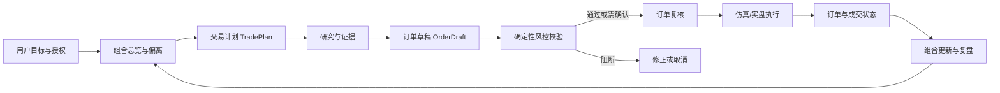
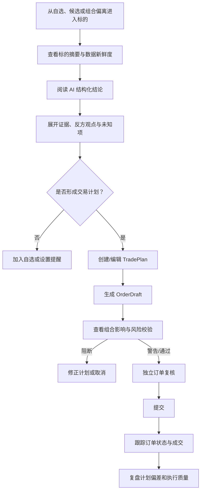
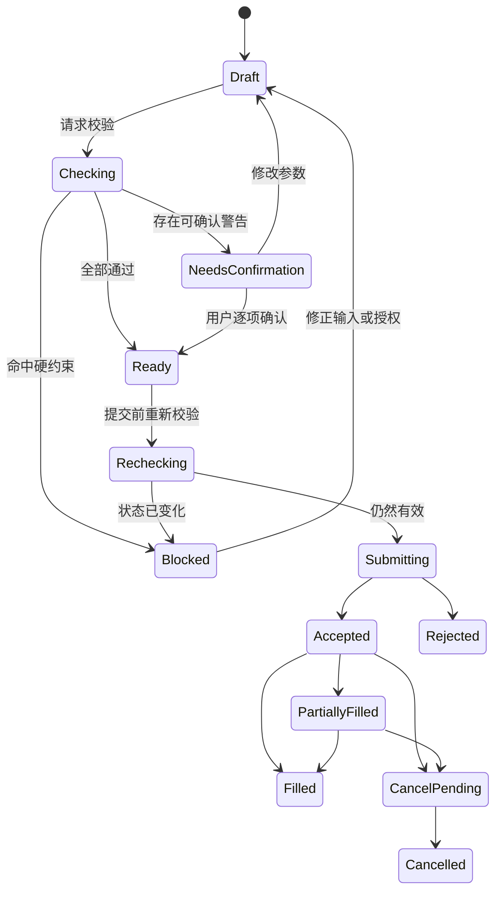

# Finance-God 交易软件形态与页面原型研究

| 项目 | 内容 |
| --- | --- |
| 文档类型 | 产品研究与原型参考 |
| 目标读者 | 产品经理、交互设计、前后端研发、量化、风控与测试 |
| 决策目标 | 确定交易相关产品形态、信息架构、关键页面、交互状态与 MVP 优先级 |
| 研究范围 | 面向普通理财用户与自主投资者的 ETF、基金及后续股票交易体验；以 Web 与移动端为主 |
| 不包含 | 品牌视觉规范、经纪商接入实现、具体司法辖区合规意见、期权/杠杆/高频交易终端设计 |
| 调研日期 | 2026-07-23 |
| 产品决策基线 | [MVP PRD Draft 2](../prd/Finance-God_MVP_PRD_v1.0.md)，作为当前产品范围、优先级和业务边界的单一依据 |
| 当前实现基线 | [Finance-God 运行说明](../../README.md)、[Multi-Agent 技术说明](../architecture/agent-swarm-technical.md)；当前已落地统一 Multi-Agent 运行时、路由与离线工作流实验，尚未形成完整交易产品 |
| 页面设计输入 | [AI 辅助交易台页面功能清单](../page-design/AI辅助交易台页面功能清单.md)，仅作为单标的手动交易页的需求输入，不代表完整产品或现有实现 |

---

## 1. 执行摘要

### 1.1 核心结论

Finance-God 的 P0 不应直接复制专业交易终端，也不应让一个“行情图 + AI 对话 + 下单框”的页面承担整个交易产品。更匹配当前用户、资产范围和风控要求的整体形态是：

> **以浏览器为主的引导式投资工作台，组合优先、任务驱动、交易计划与订单执行分层；移动端承担提醒、复核、确认与复盘。**

推荐采用三端分工：

| 产品表面 | 主要任务 | P0 定位 |
| --- | --- | --- |
| Web 工作台 | 组合诊断、候选研究、策略审阅、订单草稿、仿真执行、证据追溯 | 主产品 |
| 移动端/响应式 Web | 待办提醒、订单复核、风险确认、状态跟踪、轻量复盘 | 配套入口 |
| 运营与风控控制台 | 风控阻断、异常处理、授权与审计查询 | 内部产品 |

可安装桌面端、多显示器自由布局、Level 2、快捷键和一键发送订单属于专业交易场景，建议推迟至 P2。TradingView、Robinhood Legend、IBKR Desktop 和 thinkorswim 都证明了可定制工作区对活跃交易者有价值，但 Finance-God 的 P0 用户是非专业、长期、组合型用户，照搬这类形态会放大认知负担和误操作风险。

### 1.2 现有 AI 辅助交易台页面的产品定位

《AI 辅助交易台页面功能清单》描述的是 Finance-God 整体产品中的一个页面，而不是完整的信息架构。该页面应被保留，并定位为：

> **面向单个标的的 AI 辅助手动交易工作台：在同一页面维持行情、研究、AI、持仓、委托和订单草稿的上下文连续性，最终交易仍由用户复核和确认。**

它在整体产品中的边界是：

1. **上游入口：** 从自选、候选、组合偏离或交易计划进入，并接收当前账户、授权、组合与标的上下文。
2. **页面内职责：** 完成标的研究、AI 解释、策略参数查看、订单草稿编辑、风险预检和当前订单/持仓管理。
3. **下游出口：** 通过页面覆盖层完成最终订单复核；提交后由执行中心持续跟踪，组合页与复盘页负责交易后的影响评估。
4. **不承担的职责：** 不负责整个产品的目标管理、组合构造、批次调仓、跨标的执行监控和长期复盘。

本文中的 T03、T05 和 T06 是这个页面内部的三个逻辑视图，分别对应主工作区、下单区和最终复核层；它们不要求实现为三个独立路由。T04 交易计划和 T07 执行中心可以独立存在，也可以从该页面以抽屉或跳转方式进入。所有视图由一个版本化的 `TradePlan` 和 `OrderDraft` 贯穿。

### 1.3 MVP 应优先验证的产品假设

| 假设 | 验证方式 | 建议指标 |
| --- | --- | --- |
| 用户能先理解“为什么调整组合”，再决定是否交易 | 观察从组合偏离进入策略说明的路径 | 组合影响查看率、证据展开率 |
| AI 结构化解释比开放对话更适合交易决策 | 对比结构化策略卡与纯对话入口 | 首次理解时间、追问率、修改率 |
| 与编辑区分离的订单复核状态能减少误操作 | 记录草稿修改、风险纠正和取消 | 风险项修正率、误提交率 |
| 明确仿真状态不会被误认成实盘 | 用户测试与状态识别题 | 模式识别正确率应为 100% |
| 移动端适合确认和跟踪，不适合完整投研 | 分析跨端任务完成路径 | 移动确认完成率、回到 Web 深入研究率 |

---

## 2. 研究问题、方法与证据边界

### 2.1 研究问题

本次研究围绕四个问题展开：

1. 交易软件常见的产品形态分别服务什么用户和任务？
2. 行情、研究、策略、下单、组合与复盘应如何分层？
3. AI 应出现在交易流程的哪些位置，如何避免与确定性风控混为一体？
4. Finance-God 的 P0 应做哪些页面和状态，哪些高级能力应推迟？

### 2.2 样本选择

样本覆盖五类产品：

| 类别 | 代表产品 | 选择原因 |
| --- | --- | --- |
| 图表研究平台 | TradingView | 研究、提醒、模拟交易与经纪商交易的衔接成熟 |
| 专业/进阶交易终端 | IBKR Desktop、thinkorswim、Webull Desktop | 代表高密度工作区、复杂订单与跨端分层 |
| 新一代浏览器交易台 | Robinhood Legend | 代表现代 Widget 布局、联动与图表内交易 |
| 目标型智能投顾 | Betterment、Wealthfront | 代表目标、组合、自动化和低干扰体验 |
| 中国综合投资终端 | 东方财富专业版 | 代表行情、资讯、问股与交易一体化的信息密度 |

### 2.3 纳入与排除标准

- 优先采用产品官方功能页、帮助中心、监管机构投资者教育材料。
- 只提取可被页面或文档直接验证的产品能力，不根据营销截图推断未说明的功能。
- 将竞品功能视为“存在性证据”，不等同于其对 Finance-God 的适用性。
- 不对竞品收益、用户规模或营销口径做比较。
- 不将美国订单规则直接当作中国市场规则；订单能力必须由市场、资产与经纪商配置共同决定。

### 2.4 证据强度

| 级别 | 定义 | 在本文中的用法 |
| --- | --- | --- |
| 高 | 官方产品文档、帮助中心、监管机构原始材料 | 支撑功能存在、订单风险与账户安全要求 |
| 中 | 官方营销页、官方新闻稿 | 支撑产品定位和工作区形态 |
| 低 | 第三方评测、用户评论 | 本次不作为关键结论依据 |

### 2.5 当前项目基线与使用方式

本文区分“已决策”“已实现”和“待设计”三种状态，避免把规划文档或页面设想写成现有能力：

| 基线层级 | 当前项目事实 | 本文如何使用 |
| --- | --- | --- |
| 已决策 | PRD Draft 2 已定义用户认知引擎、Multi-Agent Workflow、组合产品层、P0 仿真交易与硬风控边界 | 作为产品定位、范围、用户与优先级的约束 |
| 已实现 | Python 项目已接入固定版本的统一 Multi-Agent 运行时，具备请求契约、能力路由、权限门禁、并发编排和离线场景实验 | 作为后续页面可调用能力与失败边界的事实依据，不据此推断交易、账户或组合能力已经完成 |
| 待设计/实现 | 页面功能清单、[基础版实现计划](../implementation/Finance-God_基础版实现计划.md)及[现有静态原型](../../prototype/index.html)仍属于需求、规划或早期视觉材料 | 作为设计输入或差距清单；不得作为已交付能力、既定信息架构或可复用交易组件 |

因此，本文提出的 Web 工作台、移动端任务流、交易计划、订单复核和执行中心，都是在现有 Multi-Agent 基础上规划的下一阶段产品形态，而不是对现有前端或交易系统的描述。原型设计应优先验证 P0 信息架构和关键状态，不以一次性覆盖完整 PRD 为目标。

---

## 3. 交易软件的五种典型形态

### 3.1 专业驾驶舱

**代表：** thinkorswim Desktop、Webull Desktop、传统 TWS 类终端。

**界面特征：**

- 多面板、多窗口、多显示器；
- 行情、自选、图表、盘口、订单、持仓同时可见；
- 支持快捷键、复杂订单、模板和自定义列；
- 用户自己决定工作区结构。

**适合：** 高频查看行情、频繁切换标的、需要并行监控的成熟交易者。

**代价：** 学习成本高、默认状态多、误操作面大。Schwab 将 thinkorswim Desktop 定义为最完整且可定制的旗舰平台，同时把 Web 版定位为更精简、更适合入门用户的浏览器体验，说明同一产品也需要按任务复杂度分层，而不是把桌面功能完整搬到 Web 或移动端。[来源：Schwab 平台比较](https://www.schwab.com/trading/thinkorswim/compare-platforms)

**对 Finance-God 的意义：** P0 不采用自由画布和多显示器形态，但数据对象、订单状态和面板独立性需要为后续扩展预留。

### 3.2 浏览器模块化工作台

**代表：** TradingView Supercharts、Robinhood Legend。

**界面特征：**

- 浏览器即主入口；
- Watchlist、图表、详情、订单和新闻通过模块联动；
- 支持保存布局，但常有默认模板降低上手成本；
- 可从自选、图表或持仓进入订单。

TradingView 将 Watchlist、提醒、筛选器、日历、新闻、投资组合和交易面板围绕图表组织，并把模拟交易作为独立的低风险练习入口。[来源：TradingView Supercharts](https://www.tradingview.com/support/solutions/43000746464-getting-started-with-supercharts/)、[模拟交易](https://www.tradingview.com/support/solutions/43000516466-paper-trading-main-functionality/)

Robinhood Legend 采用可缩放 Widget、预设布局和动态联动，用户可从 Watchlist、图表或期权链发起订单。[来源：Robinhood Legend](https://robinhood.com/us/en/legend/)

**适合：** 需要研究与执行连续性，但不想安装重型客户端的用户。

**对 Finance-God 的意义：** 这是 P0 最接近的形态，但应使用固定布局和渐进披露，不开放自由 Widget 画布。

### 3.3 移动任务流

**代表：** Robinhood Mobile、Betterment Mobile、thinkorswim Mobile。

**界面特征：**

- 单任务、单列、分步确认；
- 首页展示资产、待办或卡片；
- 复杂分析被压缩为摘要、Tab 或二级页；
- 适合通知触发、轻量调整和状态跟踪。

Betterment 的移动端从总净值进入具体账户，再查看持仓、调整组合策略或配置，并将活动记录作为独立可筛选页面，体现了“总览—账户—操作—历史”的清晰层级。[来源：Betterment 移动投资管理](https://www.betterment.com/help/mobile-investment-management)

**适合：** 快速检查、确认和跟踪，不适合复杂多源证据比较。

**对 Finance-God 的意义：** 移动端应是“确认器和伴随端”，不应尝试压缩完整交易台。

### 3.4 目标与组合中心

**代表：** Betterment、Wealthfront。

**界面特征：**

- 从目标、期限和风险出发，而不是从标的出发；
- 首页突出净值、目标进度、组合和预测；
- 调仓是目标变化或组合偏离的结果；
- 自动化运行在后台，用户主要处理例外和重大变化。

Betterment 将不同目标拆成独立组合和风险水平，并根据目标期限提供组合建议；其自助交易体验还在卖出前展示税务影响，说明交易复核页可以呈现“账户后果”，而不只显示订单参数。[来源：Betterment 目标组合](https://www.betterment.com/help/investment-portfolio-setup)、[自助投资](https://www.betterment.com/resources/self-directed-investing-at-betterment)

Wealthfront 以自动管理的分散化投资组合为核心，持续再平衡、再投资并允许有限度的 ETF 调整，代表低干扰的自动化产品形态。[来源：Wealthfront Automated Investing](https://www.wealthfront.com/investing)

**适合：** 长期投资者、非专业用户、目标型资产配置。

**对 Finance-God 的意义：** 首页、组合页和调仓计划应采用这种组合优先模型；单标的交易台只是下游工具。

### 3.5 运营与风控控制台

**代表：** 券商后台、组合运营台、风控工作台。

**界面特征：**

- 以异常、阻断、任务队列和审计检索为核心；
- 高信息密度但操作权限严格；
- 需要展示规则、输入版本、处理人和处置记录；
- 与面向投资者的产品表面分离。

**适合：** 风控、运营、客服、合规与技术支持。

**对 Finance-God 的意义：** 不应把内部 Agent 日志和规则细节直接堆到用户交易页；用户看到可理解的原因，内部控制台保留完整诊断证据。

### 3.6 形态适配评分

评分为本研究根据项目目标做出的产品推断，5 分最适合 P0。

| 形态 | 普通用户易用性 | 组合导向 | 交易完整性 | AI 可解释性承载 | P0 适配度 |
| --- | ---: | ---: | ---: | ---: | ---: |
| 专业驾驶舱 | 1 | 2 | 5 | 3 | 2 |
| 浏览器模块化工作台 | 4 | 3 | 4 | 5 | **5** |
| 移动任务流 | 5 | 4 | 2 | 3 | **4（配套）** |
| 目标与组合中心 | 5 | 5 | 2 | 4 | **5（上游）** |
| 运营与风控控制台 | 1 | 3 | 5 | 5 | **5（内部）** |

---

## 4. 竞品功能对比与可迁移模式

| 产品 | 已验证的形态或功能 | 值得借鉴 | 不建议在 P0 照搬 |
| --- | --- | --- | --- |
| TradingView | 多图布局、Watchlist、提醒、筛选器、图表交易、模拟交易 | 研究上下文联动；模拟与实盘使用同一订单模型；图表、订单和持仓互相定位 | Pine 编辑器、社区内容、复杂绘图工具全集 |
| IBKR Desktop | 单工作区覆盖研究、市场数据、交易、组合和风险；布局可扩展 | 全交易生命周期；初级到高级渐进扩展；组合和风险保持可见 | 全球多资产复杂度、一键交易、专业级全部订单类型 |
| Robinhood Legend | 浏览器 Widget、预设布局、动态联动、图表内订单 | 现代工作区；从多个上下文发起统一订单草稿；跨 Widget 标的同步 | Auto-send、交易快捷键、默认追求速度 |
| thinkorswim | Desktop/Web/Mobile 分层；paperMoney；高级图表与条件单 | 同一服务按终端和用户成熟度分层；模拟模式贯穿多端 | 把桌面能力压缩进移动端；复杂默认布局 |
| Webull Desktop | 拖放 Widget、多种订单入口、模拟交易 | 后续专业模式的参考；订单入口统一到同一状态机 | P0 自由布局、价格梯、期货快速交易 |
| Betterment | 目标型组合、移动端账户层级、卖出前影响预览 | 目标—组合—交易的上游链路；交易前展示组合与账户后果 | 纯后台自动化导致的过程不可见 |
| Wealthfront | 自动再平衡、分散化组合、有限度自定义 | 让正常自动化保持安静，只把例外推给用户 | 直接复用美国税务功能和口径 |
| 东方财富专业版 | 行情、资讯、交易和在线问股集成 | 本地用户熟悉的行情—资讯—交易连续性 | 首页和交易页过高的信息密度；买卖点式确定性表达 |

### 4.1 可迁移的共性模式

1. **保存工作上下文。** 标的、周期、图层、筛选条件和草稿需要跨页面恢复。
2. **一个订单模型，多种入口。** Watchlist、图表、持仓和组合偏离都可以创建订单草稿，但最终进入同一复核流程。
3. **模拟与实盘共用状态机。** 两者仅账户、权限、行情和成交实现不同，不创建两套页面逻辑。
4. **总览处理例外，详情支持判断。** 首页不堆工具，只展示待确认、风险事件、组合偏离和执行异常。
5. **高级能力渐进开放。** 自定义布局、复杂订单和快捷交易不应成为默认体验。

### 4.2 需要避免的反模式

- 把涨跌幅、热榜和强烈颜色作为首页第一注意力；
- 用“AI 看涨/看跌”替代适用周期、证据、反方观点和失效条件；
- 将聊天记录当成交易计划的唯一来源；
- 在同一按钮上混用“采纳策略”“生成订单”“提交订单”；
- 在行情延迟、休市或授权失效时继续展示可立即执行的主按钮；
- 只展示“提交成功”，不展示已受理、部分成交、撤单中和拒单；
- 用默认勾选、倒计时或奖励动画推动交易；
- 在仿真页面使用与实盘完全相同但没有明显模式标识的视觉。

---

## 5. Finance-God 推荐产品形态

### 5.1 总体架构



### 5.2 三层产品模型

| 层 | 用户问题 | 主要页面 | 设计重点 |
| --- | --- | --- | --- |
| 决策层 | 为什么现在需要关注或调整？ | 总览、组合、候选、标的研究、策略说明 | 目标、组合影响、证据和不确定性 |
| 执行层 | 具体要提交什么，后果是什么？ | 交易计划、订单草稿、订单复核、执行中心 | 参数、费用、风险、状态和可撤销性 |
| 信任层 | 系统依据什么做了什么？ | 数据来源、版本记录、授权、复盘、审计 | 可追溯、可校正、可暂停 |

### 5.3 导航建议

面向普通用户的一级导航建议收敛为：

1. **总览**：待处理事项、组合状态、风险与执行异常；
2. **组合**：当前持仓、目标组合、偏离、调仓计划；
3. **交易**：交易计划、订单、成交、模拟账户；
4. **投研**：自选、候选、筛选、标的详情、研究报告；
5. **复盘**：表现、风险事件、执行质量、决定记录；
6. **授权与设置**：用户画像、投资授权、账户、数据和提醒。

现有 PRD 中的“Agent 中心”建议调整为：

- 普通模式：在每个结论中提供“查看过程与证据”抽屉；
- 高级模式：提供完整 Agent 工作流页；
- 内部模式：保留输入输出、错误栈、重试、规则命中和版本图。

这样能保留可追溯性，同时避免让用户先理解 Agent 组织结构才能完成投资任务。

### 5.4 跨端职责

| 任务 | Web | 移动端 | 内部控制台 |
| --- | --- | --- | --- |
| 组合总览 | 完整 | 摘要 | 查询 |
| 多源研究 | 完整 | 结论与收藏 | 诊断 |
| 策略调整 | 完整 | 轻量参数 | 只读/介入 |
| 订单草稿 | 完整 | 简化 | 只读 |
| 订单确认 | 支持 | 重点支持 | 不代替用户 |
| 订单跟踪 | 完整 | 重点支持 | 异常处置 |
| 风控规则 | 用户可理解摘要 | 关键原因 | 完整命中链 |
| Agent 过程 | 可展开 | 仅摘要 | 完整 |
| 审计导出 | 支持 | 查看 | 完整检索与导出 |

---

## 6. 关键对象与单一事实源

交易页面不应各自维护一份“AI 建议”和“用户订单”。推荐使用以下对象贯穿页面：

| 对象 | 作用 | 必要版本关系 |
| --- | --- | --- |
| `InvestmentMandate` | 用户目标、风险预算、资产范围、自主级别和有效期 | 所有计划必须引用 |
| `PortfolioSnapshot` | 某一时点的现金、持仓、暴露和偏离 | 计划与复核必须引用 |
| `MarketDataSnapshot` | 行情值、来源、市场状态、时间戳和延迟 | 研究、估算与提交校验引用 |
| `ResearchArtifact` | 事实、推断、反方观点、未知项、来源 | `TradePlan` 引用 |
| `TradePlan` | 调整目的、适用周期、目标变化、失效条件和候选动作 | 订单草稿的唯一上游 |
| `OrderDraft` | 尚未提交的方向、类型、数量、价格、有效期 | 可编辑并保留偏离说明 |
| `RiskCheckResult` | 规则级通过、警告、阻断和原因 | 不可被 AI 覆盖 |
| `Order` | 已提交订单及状态 | 从已确认草稿创建 |
| `Fill` | 实际成交 | 更新持仓与执行质量 |
| `ReviewRecord` | 计划、订单、结果与用户反馈的复盘 | 反馈到下一周期 |

### 6.1 核心不变量

1. `OrderDraft` 必须引用一个有效的 `TradePlan`，纯手动交易则创建“用户自定义计划”，不能让来源为空。
2. AI 可以创建或修改 `TradePlan` 提案，但不能创建已提交的 `Order`。
3. 风控结果来自确定性规则服务；AI 只能解释，不能把 `BLOCK` 改成 `WARN`。
4. 提交时必须重新校验授权、行情、账户、持仓和市场状态，不能复用已过期的页面校验。
5. 订单状态只来自执行服务或经纪商回报，不能由前端或 AI 推断。
6. 仿真和实盘共享对象模型，但所有页面必须显示不可混淆的模式标识。

---

## 7. 核心任务流

### 7.1 单标的研究到交易



### 7.2 组合调仓到批次执行

组合型用户更常见的任务不是买一只标的，而是确认一组目标权重变化：

1. 系统发现目标组合与当前组合偏离；
2. 用户先查看“为什么调仓”和“不调仓的后果”；
3. `TradePlan` 包含多笔候选订单和执行顺序；
4. 用户可接受整个计划、排除某笔或调整金额；
5. 系统重新计算剩余订单、费用、现金和风险；
6. 用户按批次确认；
7. 执行中心展示批次进度和每笔订单状态；
8. 复盘页比较计划权重、成交后权重与剩余偏离。

### 7.3 风控阻断



---

## 8. 页面原型总览

### 8.1 页面与逻辑视图清单

| 编号 | 页面或逻辑视图 | 推荐承载方式 | 核心任务 | P0 |
| --- | --- | --- | --- | --- |
| T01 | 交易总览/决策收件箱 | 独立页面 | 知道今天需要处理什么 | 是 |
| T02 | 自选与候选 | 独立页面 | 管理关注对象并发现与组合相关的候选 | 是 |
| T03 | AI 辅助交易台主工作区 | **现有页面** | 查看行情、研究、AI、持仓和委托 | 是 |
| T04 | 交易计划详情 | 独立页面或抽屉 | 审阅调整目的、周期、失效条件和组合影响 | 是 |
| T05 | 订单草稿 | T03 页面右侧下单区 | 编辑可执行参数并查看实时估算 | 是 |
| T06 | 订单复核 | T03 页面覆盖层或全屏弹层 | 完成最终确认 | 是 |
| T07 | 执行中心 | 独立页面；T03 底栏展示当前标的摘要 | 跟踪订单、成交、撤单和异常 | 是 |
| T08 | 组合与偏离 | 独立页面 | 解释当前持仓到目标组合的路径 | 是 |
| T09 | 交易复盘 | 独立页面 | 比较计划、执行与结果 | 是 |
| T10 | 过程与证据 | T03 侧栏抽屉 | 查看 Agent 产物、输入版本和审计 | 是 |
| T11 | 专业可定制工作区 | T03 的后续专业模式 | 多图、Widget、多显示器 | 否，P2 |

### 8.2 AI 辅助交易台页面骨架

下面的骨架对应《AI 辅助交易台页面功能清单》所描述的单个页面。T03 是页面主体，T05 是右侧下单区，T06 在提交前覆盖当前页面；底栏只显示当前标的的持仓、委托和成交，全账户执行监控仍由 T07 承担。

```text
┌──────────────────────────────────────────────────────────────────────────────┐
│ 模式：仿真账户        市场：交易中/休市        行情：实时/延迟 15 分钟       │
├────────┬───────────────────────────────────────────────┬─────────────────────┤
│ 一级   │ 主任务区                                      │ 上下文侧栏          │
│ 导航   │                                               │                     │
│        │ 页面标题 / 标的 / 组合 / 时间范围             │ AI 结论             │
│ 总览   │                                               │ 证据与不确定性      │
│ 组合   │ 图表、表格、计划或订单主内容                  │ 风险与规则结果      │
│ 交易   │                                               │ 主要下一步          │
│ 投研   │                                               │                     │
│ 复盘   │                                               │                     │
├────────┴───────────────────────────────────────────────┴─────────────────────┤
│ 可展开底栏：持仓 / 当前委托 / 成交 / 事件日志                                │
└──────────────────────────────────────────────────────────────────────────────┘
```

建议：

- 一级导航固定为 72–88 px；
- 主任务区优先获得宽度；
- 上下文侧栏为 360–420 px，可折叠；
- 底栏只在标的研究与执行中心出现；
- 账户模式、市场状态、行情时点始终可见；
- 页面只保留一个主操作按钮。

---

## 9. 关键页面低保真原型与功能

### 9.1 T01 交易总览/决策收件箱

**页面目标：** 用户在 30 秒内知道系统是否正常、组合是否需要处理、有哪些订单或风险事件。

```text
┌─────────────────────────────────────────────────────────────────────┐
│ 早上好，当前为【仿真】账户   数据截至 10:31:08   [暂停 Agent]       │
├───────────────────────┬─────────────────────────────────────────────┤
│ 组合状态              │ 待处理                                     │
│ 总资产 / 现金         │ 1. 调仓计划等待确认（影响 3 个持仓）        │
│ 目标达成概率区间      │ 2. 1 笔订单部分成交                         │
│ 最大回撤 / 风险预算   │ 3. 授权书将在 7 天后到期                    │
├───────────────────────┼─────────────────────────────────────────────┤
│ 需要关注              │ 最近活动                                   │
│ 组合偏离 4.2%         │ 订单、成交、风控阻断、用户修改              │
│ 数据异常 1 项         │                                             │
│ 市场事件 2 项         │                                             │
└───────────────────────┴─────────────────────────────────────────────┘
```

**P0 功能：**

- 账户模式、市场状态、行情新鲜度；
- 组合摘要：资产、现金、收益、风险预算、目标偏离；
- 决策收件箱：调仓待确认、订单异常、授权到期、数据问题；
- 风险事件与 Agent 暂停；
- 最近活动与审计入口；
- 每个卡片只提供一个明确下一步。

**不应出现：**

- 默认热榜、涨跌榜和社区情绪；
- 无法解释与用户组合关系的“今日机会”；
- 推动频繁交易的倒计时和奖励。

### 9.2 T02 自选与候选

**页面目标：** 把“用户主动关注”和“系统基于组合缺口提出的候选”分开呈现。

```text
┌─────────────────────────────────────────────────────────────────────┐
│ 自选与候选   [搜索股票/ETF/基金]   [筛选]                           │
├────────────────────────────┬────────────────────────────────────────┤
│ 我的自选                   │ 与组合相关的候选                       │
│ 名称 价格 涨跌 风险 更新时间│ 候选作用：降低集中度 / 补足债券暴露   │
│ 沪深300ETF ...             │ 适配度  费用  流动性  主要风险         │
│ 中短债基金 ...             │ [查看研究] [忽略并说明原因]            │
├────────────────────────────┴────────────────────────────────────────┤
│ 筛选条件：资产类型、地区、费用、规模、流动性、风险、组合角色       │
└─────────────────────────────────────────────────────────────────────┘
```

**P0 功能：**

- 标的搜索与主数据确认；
- 自选分组、排序、风险标记、分析更新时间；
- 候选的组合角色、适配原因、排除原因；
- 基础筛选：资产类型、市场、费用、规模、流动性、风险；
- 加入自选、忽略候选、进入研究、创建提醒。

**关键规则：**

- “候选评分”必须拆解为组合适配、数据质量、流动性与风险，不能显示无来源的单一神秘分数；
- 候选是研究入口，不提供直接买入按钮；
- 推荐理由必须回答“它对当前组合解决什么问题”。

### 9.3 T03 AI 辅助交易台主工作区

**页面目标：** 在同一页面上下文中查看行情、基本事实、AI 结论、反方观点、持仓、委托与订单草稿；订单只能通过 T06 复核状态提交。

```text
┌────────────────────────────────────────────────────────┬────────────┐
│ 沪深300ETF  510300  ¥x.xx  +x.xx%  行情 10:31:08       │ AI 研究    │
│ [概览] [图表] [基本面] [持仓穿透] [资讯与事件]         │ 结论：观察 │
├────────────────────────────────────────────────────────┤ 周期：6月  │
│                                                        │ 置信度：中 │
│  日/周 K 线 + 成交量 + 最多 3 个默认指标               ├────────────┤
│  可切换时间范围；显示持仓成本、提醒和计划线            │ 支持证据 3 │
│                                                        │ 反方证据 2 │
├────────────────────────────────────────────────────────┤ 未知项 1   │
│ 费用 / 规模 / 跟踪误差 / 流动性 / 组合重叠 / 数据来源  ├────────────┤
│                                                        │ [创建计划] │
└────────────────────────────────────────────────────────┴────────────┘
```

**P0 功能：**

- 行情摘要、市场状态、时间戳、延迟和数据源；
- 日/周 K 线、成交量、MA/EMA/BOLL 等有限默认指标；
- 基金/ETF 关键事实：费率、规模、指数、跟踪误差、流动性、持仓穿透；
- 当前组合中的持仓、成本、权重、重叠和目标作用；
- AI 结构化研究卡；
- 支持证据、反方观点、未知项、失效条件；
- 创建提醒、加入自选、创建交易计划；
- “为什么更新”与上次研究差异。

**P1/P2：**

- 分钟级图表、绘图工具、自定义指标、多图布局；
- Level 2、盘口和逐笔成交；
- 图表直接拖拽修改订单。

### 9.4 T04 交易计划详情

**页面目标：** 在订单参数出现之前，先确认投资目的、组合影响和失效条件。

该视图可以作为独立页面，也可以从 AI 辅助交易台的 AI 侧栏打开为宽抽屉；复杂的多标的调仓计划更适合独立页面。

```text
┌─────────────────────────────────────────────────────────────────────┐
│ 交易计划 TP-20260723-001                  状态：等待用户审阅         │
├──────────────────────────────┬──────────────────────────────────────┤
│ 为什么调整                   │ 调整后的组合                         │
│ · 目标：降低单一市场集中度   │ 当前权重 → 目标权重                  │
│ · 触发：偏离阈值 4.2%        │ 风险预算：使用前/后                  │
│ · 周期：6–12 个月            │ 现金、费用、流动性影响               │
│ · 不行动的后果               │ 压力情景变化                         │
├──────────────────────────────┼──────────────────────────────────────┤
│ 计划依据                     │ 候选动作                             │
│ 授权版本 / 组合快照 / 研究   │ 买入 A / 卖出 B / 保留 C             │
│ 反方观点 / 未知项 / 失效条件 │ [排除] [改金额] [查看标的]           │
├──────────────────────────────┴──────────────────────────────────────┤
│ [暂不处理] [保存并设置提醒]                 [生成订单草稿]           │
└─────────────────────────────────────────────────────────────────────┘
```

**P0 功能：**

- 调整目的、触发原因、时间周期、不行动的后果；
- 当前组合与目标组合对比；
- 风险预算、现金、费用、集中度和压力情景变化；
- 支持证据、反方观点、未知项、失效条件；
- 关联授权、组合快照、研究产物和数据版本；
- 接受、排除、调整、延后和取消；
- 生成单笔或批次 `OrderDraft`。

**关键规则：**

- 交易计划不是聊天消息，而是可版本化、可比较、可撤销的结构化对象；
- 修改任一候选动作后必须重新计算整体组合影响；
- “AI 推荐”不等同于“风控已通过”。

### 9.5 T05 订单草稿（交易台右侧下单区）

**页面目标：** 编辑订单参数，并持续看到参数变化对账户和组合造成的影响。

```text
┌──────────────────────────────────────────┬──────────────────────────┐
│ 买入 沪深300ETF                         │ 实时估算                 │
│ 账户：仿真-长期组合                     │ 交易金额                 │
│ 订单类型：[限价]                        │ 费用与滑点假设           │
│ 数量：[____] 股 / 金额：[____]          │ 剩余现金                 │
│ 限价：[____]   有效期：[当日]           │ 成交后权重               │
│ 可选风险参数：止损 / 提醒                │ 与目标组合偏离           │
├──────────────────────────────────────────┼──────────────────────────┤
│ 与计划差异                              │ 风控预检                 │
│ 数量比计划高 8%                         │ ✓ 资产范围               │
│ 风险预算增加 0.3%                       │ ! 集中度接近上限          │
│ [恢复计划参数]                          │ ✓ 现金充足               │
├──────────────────────────────────────────┴──────────────────────────┤
│ [保存草稿]                                        [进入订单复核]     │
└─────────────────────────────────────────────────────────────────────┘
```

**P0 功能：**

- 买卖方向、限价/市价、按份额/金额、价格、有效期；
- 可买/可卖、最小单位和市场规则；
- 费用、滑点、现金、成交后持仓和组合偏离估算；
- 与 `TradePlan` 的差异及风险变化；
- 风控预检；
- 保存草稿、恢复计划参数、进入复核；
- 行情变化时刷新估算并明确标记。

**订单类型策略：**

- P0 默认限价单；是否开放市价单由市场与资产配置决定；
- 高级订单不只增加控件，还需要对应解释、触发逻辑和状态机；
- 市价单不能显示确定成交价。美国 SEC 的投资者材料明确指出，市价单通常立即执行，但成交价格不受保证；止损触发价也不等于成交价。[来源：Investor.gov 订单类型](https://www.investor.gov/introduction-investing/general-resources/news-alerts/alerts-bulletins/investor-bulletins-14)

### 9.6 T06 订单复核（交易台页面覆盖层）

**页面目标：** 在不离开 AI 辅助交易台路由的前提下，将“用户确认”从编辑环境中分离出来，避免连续点击造成误提交。

```text
┌─────────────────────────────────────────────────────────────────────┐
│ 最终复核                                             步骤 2 / 2      │
├─────────────────────────────────────────────────────────────────────┤
│ 【仿真账户】买入 510300 沪深300ETF                                  │
│ 数量：1,000 股     限价：¥x.xx     有效期：当日                    │
│ 预计金额：¥xx,xxx  费用：¥xx       行情时间：10:31:08              │
├─────────────────────────────────────────────────────────────────────┤
│ 组合后果：权重 x% → y%；现金 x% → y%；风险预算剩余 z%              │
│ 计划依据：TP-20260723-001；授权版本：v3                             │
├─────────────────────────────────────────────────────────────────────┤
│ 风控结果                                                            │
│ ✓ 5 项通过   ! 1 项需确认：价格距最新价 1.8%                        │
│ [ ] 我已理解限价单可能无法成交                                      │
├─────────────────────────────────────────────────────────────────────┤
│ [返回修改]                                      [确认提交仿真订单]  │
└─────────────────────────────────────────────────────────────────────┘
```

**P0 功能：**

- 模式、账户、标的、方向、数量、价格、有效期、费用和行情时点；
- 组合后果、计划与授权版本；
- 风控结果逐项展示；
- 对特定警告进行显式确认；
- 返回修改；
- 提交中状态防止重复操作；
- 提交结果跳转执行中心。

**交互约束：**

- 仿真按钮必须包含“仿真”字样，实盘按钮必须包含账户简称；
- 风控阻断时不显示可提交主按钮；
- 提交后不能用前端乐观更新伪造“已成交”；
- 生物识别、MFA 和账户活动提醒应作为实盘能力的安全依赖。SEC 2026 年账户安全材料建议启用多因素认证和交易/账户变更提醒。[来源：Investor.gov 在线账户安全](https://www.investor.gov/introduction-investing/general-resources/news-alerts/alerts-bulletins/investor-bulletins/updated-2)

### 9.7 T07 执行中心

**页面目标：** 准确跟踪订单生命周期，并提供合法的撤单、重试和问题诊断入口。

```text
┌─────────────────────────────────────────────────────────────────────┐
│ 执行中心  [全部] [处理中] [部分成交] [已完成] [异常]                │
├─────────────────────────────────────────────────────────────────────┤
│ 批次 RB-001：2/3 笔完成       预计组合偏离 1.1%                     │
├────────┬──────┬──────┬──────────┬──────────┬──────────┬────────────┤
│ 时间   │ 标的 │ 方向 │ 价格/数量│ 已成交   │ 状态     │ 操作       │
│ 10:32  │510300│ 买入 │ x / 1000 │ 600      │ 部分成交 │ 查看/撤余 │
│ 10:30  │xxxxxx│ 卖出 │ x / 500  │ 500      │ 已成交   │ 查看       │
├────────┴──────┴──────┴──────────┴──────────┴──────────┴────────────┤
│ 事件时间线：草稿 → 校验 → 用户确认 → 受理 → 部分成交 → ...         │
└─────────────────────────────────────────────────────────────────────┘
```

**P0 功能：**

- 单笔与批次视图；
- 已提交、受理、部分成交、已成交、撤单中、已撤、已拒、已过期；
- 原始数量、成交数量、剩余数量、均价、费用、时间；
- 查看详情、撤单、撤余、修正后重建草稿；
- 订单事件时间线和外部回报编号；
- 异常原因与下一步；
- 成交后组合变化和剩余偏离。

**关键规则：**

- “提交成功”只能表示请求已发送，不能替代“经纪商已受理”；
- 撤单请求不能立即显示为“已撤”；
- 部分成交后修改订单需要明确剩余数量；
- 拒单后保留原始证据，不自动静默重试。

### 9.8 T08 组合与偏离

**页面目标：** 让用户从目标和风险理解持仓，而不是只看单个资产涨跌。

```text
┌─────────────────────────────────────────────────────────────────────┐
│ 我的组合  总资产 ¥xxx,xxx  本月 x%  风险预算使用 x%                │
├──────────────────────────────┬──────────────────────────────────────┤
│ 资产配置 当前 vs 目标        │ 目标与偏离                           │
│ 股票 / 债券 / 现金           │ 退休目标：正常                       │
│ 地区 / 行业 / 币种           │ 应急资金：不足                       │
├──────────────────────────────┼──────────────────────────────────────┤
│ 风险                        │ 持仓                                  │
│ 集中度、回撤、波动、情景     │ 权重、成本、收益、目标权重、偏离     │
├──────────────────────────────┴──────────────────────────────────────┤
│ 当前建议：需要调仓 / 无需操作 / 数据不足       [查看交易计划]       │
└─────────────────────────────────────────────────────────────────────┘
```

**P0 功能：**

- 当前与目标资产配置；
- 目标进度、风险预算和现金边界；
- 暴露、集中度、重叠、偏离和压力情景；
- 持仓与目标权重；
- 数据来源、更新时间和未解析项；
- 调仓计划入口；
- 查看“保持不动”的影响。

### 9.9 T09 交易复盘

**页面目标：** 比较计划、执行和结果，帮助用户和系统改进过程，而不是评价短期盈亏。

**P0 功能：**

- 计划目标与实际动作；
- 计划参数、用户修改和修改原因；
- 预估价格与实际成交、费用、滑点、完成率；
- 成交后组合与目标偏离；
- 风控事件、撤单和拒单；
- 计划是否触发失效条件；
- 用户反馈：理解、不同意、数据错误、以后不再提示；
- 生成 `ReviewRecord`，供下一轮研究使用。

**评价顺序：**

1. 是否遵守授权和风险边界；
2. 是否按计划执行；
3. 执行质量如何；
4. 组合是否更接近目标；
5. 最后才是收益结果，而且需要匹配计划周期。

### 9.10 T10 过程与证据抽屉

**页面目标：** 让用户可以追溯但不被技术过程淹没。

**普通模式：**

- 使用了哪些数据、时点和来源；
- 哪些是事实、推断、假设和未知项；
- 支持与反方证据；
- 哪条授权和规则影响了结论；
- 与上个版本相比改变了什么。

**高级模式：**

- Planner、Data、Research、Factor、Strategy、Backtest、Report 的任务状态；
- 输入输出版本、反馈轮次、失败原因和重试；
- 结果置信度和适用范围。

**内部模式：**

- 完整事件、Trace ID、规则命中、错误栈、服务版本和人工处置；
- 不在用户界面展示敏感内部实现或其他用户数据。

---

## 10. 移动端原型

### 10.1 移动首页

```text
┌──────────────────────┐
│ Finance-God  【仿真】│
│ 数据截至 10:31       │
├──────────────────────┤
│ 组合状态：需确认     │
│ 偏离 4.2%  风险正常 │
│ [查看调仓计划]       │
├──────────────────────┤
│ 待处理 3             │
│ · 订单等待确认       │
│ · 部分成交           │
│ · 授权即将到期       │
├──────────────────────┤
│ 最近活动             │
└──────────────────────┘
```

### 10.2 移动订单确认

```text
┌──────────────────────┐
│ 最终复核             │
│ 【仿真账户】         │
├──────────────────────┤
│ 买入 沪深300ETF      │
│ 1000 股 × 限价 ¥x.xx │
│ 预计金额 / 费用      │
├──────────────────────┤
│ 组合权重 x% → y%     │
│ 风险预算剩余 z%      │
├──────────────────────┤
│ ! 1 项需确认         │
│ [展开原因]           │
├──────────────────────┤
│ [返回] [确认仿真提交]│
└──────────────────────┘
```

### 10.3 移动端边界

P0 移动端支持：

- 总览、待办、提醒；
- 研究结论摘要与证据；
- 订单复核和状态跟踪；
- 撤单和暂停 Agent；
- 组合摘要与复盘。

P0 移动端不支持：

- 多图研究；
- 批量复杂编辑；
- 自定义指标和布局；
- 完整 Agent 调试信息；
- 快捷键和 Auto-send。

---

## 11. AI 在交易页面中的产品契约

### 11.1 AI 输出结构

每次可用于形成交易计划的 AI 输出至少包含：

| 字段 | 说明 |
| --- | --- |
| 结论 | 买入、卖出、持有、等待或数据不足；允许无动作 |
| 适用周期 | 例如 1–4 周、6–12 个月，不使用模糊“短期” |
| 组合作用 | 降低集中度、补足暴露、提高流动性等 |
| 支持事实 | 可追溯数据和来源 |
| 反方观点 | 能推翻或削弱结论的证据 |
| 未知项 | 数据缺失、来源冲突或无法验证的信息 |
| 失效条件 | 结论何时不再适用 |
| 建议动作 | 目标权重或金额区间，不直接创建订单 |
| 置信度 | 由证据完整性和一致性解释，不展示伪精确概率 |
| 数据版本 | 研究、行情、组合、授权的版本和时间 |

### 11.2 页面状态

| 状态 | 页面表现 | 可用操作 |
| --- | --- | --- |
| 排队中 | 显示任务和预计阶段，不伪造结果 | 取消、离开页面 |
| 分析中 | 展示已完成步骤和当前数据时点 | 查看已有事实 |
| 数据不足 | 明确缺什么以及影响 | 补充数据、仅加入自选 |
| 来源冲突 | 并列冲突信息 | 查看来源、请求复核 |
| 已完成 | 结构化结论和版本 | 创建计划、追问 |
| 已过期 | 结论保留但禁用直接生成草稿 | 重新分析 |
| 失败 | 显式错误和 Trace ID | 重试、继续手动研究 |

### 11.3 AI 与规则引擎的分界

| AI | 规则引擎 |
| --- | --- |
| 提炼信息、形成假设、解释证据 | 判断授权、资产范围、资金、数量、市场状态 |
| 提出交易计划 | 对订单进行通过、警告或阻断 |
| 解释参数变化 | 计算确定性账户与组合约束 |
| 解释阻断原因 | 产生不可被 AI 修改的规则结果 |
| 可以承认数据不足 | 数据过期时显式失败，不静默降级 |

---

## 12. 关键异常与边界状态

| 场景 | 页面行为 | 是否允许进入复核/提交 |
| --- | --- | --- |
| 市场休市 | 显示下次交易时段和订单有效方式 | 由市场规则决定，不默认立即执行 |
| 行情过期 | 冻结旧估算，标记过期并请求刷新 | 不允许提交，重新校验后恢复 |
| 标的不支持 | 说明资产/市场/账户限制 | 不允许 |
| 授权过期 | 指向授权更新并保留草稿 | 不允许 |
| 资金不足 | 显示缺口和可调整数量 | 不允许 |
| 可卖数量不足 | 区分总持仓、冻结和可卖 | 不允许 |
| 集中度超限 | 显示当前与上限、受影响规则 | 硬限制不允许 |
| 接近风险上限 | 展示增量影响和确认项 | 可配置为警告 |
| AI 不可用 | 研究区显式失败；手动草稿能力保留 | 取决于授权和规则，不以 AI 可用性决定 |
| 数据源冲突 | 标记冲突、来源和影响范围 | 关键字段冲突则不允许 |
| 订单提交超时 | 保持“状态未知”，主动查询 | 禁止重复提交 |
| 部分成交 | 展示成交与剩余；更新临时组合 | 可撤余，不自动重下 |
| 撤单中 | 显示请求已发送 | 不得显示已撤 |
| 拒单 | 展示经纪商/规则原因和原始订单 | 修正后创建新草稿 |
| 网络断开 | 本地草稿可保留；订单状态标记未知 | 不允许提交 |
| 仿真成交模型缺失 | 明确说明无法估算 | 不伪造成交 |

---

## 13. 功能优先级

### 13.1 P0：验证闭环

**产品形态**

- 浏览器固定布局工作台；
- 响应式移动确认页；
- 仿真账户；
- 内部风险与审计基础查询。

**页面**

- T01–T10；
- 标的研究只支持日/周级核心图表；
- 单笔订单和多笔调仓批次；
- 订单状态机、撤单、部分成交、拒单；
- 过程与证据抽屉。

**交易能力**

- ETF、公募基金；股票能力按 PRD 后续范围启用；
- 限价单为默认；
- 是否支持市价单、有效期和盘后订单由市场适配层配置；
- 费用和滑点假设；
- 提交前重新校验。

### 13.2 P1：提高研究效率

- 更完整的筛选器和组合候选；
- 更多图表指标、提醒和事件日历；
- 策略版本比较和回测摘要；
- 经纪商连接状态和批次实盘确认；
- 跨端工作上下文同步；
- 账户与交易活动安全提醒。

### 13.3 P2：专业模式

- 可安装桌面端或 PWA；
- 自由 Widget 布局、布局模板、多显示器；
- 多图联动、绘图工具、自定义指标；
- Level 2、盘口和价格梯；
- 复杂订单、快捷键；
- 专业用户可配置的订单模板；
- 所有高风险快捷能力必须单独授权，默认关闭。

### 13.4 明确不进入近期范围

- 以交易次数、连续签到或收益排行为目标的游戏化；
- 社区跟单与未经验证的信号市场；
- AI 自动放宽风险或自动开启实盘；
- 为追求“始终有答案”而隐藏数据不足；
- 生成无法追溯来源的确定性买卖点。

---

## 14. 研发拆分建议

| 交付包 | 核心能力 | 前置依赖 | 验收证据 |
| --- | --- | --- | --- |
| A. 交易对象模型 | TradePlan、OrderDraft、RiskCheck、Order、Fill | 授权与组合对象 | Schema、状态机测试 |
| B. 组合与总览 | 组合快照、目标偏离、决策收件箱 | 持仓与行情 | 页面测试、数据时点测试 |
| C. 研究工作区 | 标的详情、AI 研究卡、证据抽屉 | 主数据与研究产物 | 事实/推断分离测试 |
| D. 草稿与复核 | 参数编辑、估算、差异、最终确认 | 风控预检 | 金额、数量、费用测试 |
| E. 仿真执行 | 提交、受理、部分成交、撤单、拒单 | 执行服务 | 状态转换与幂等测试 |
| F. 复盘与审计 | 计划—订单—成交链路 | 事件日志 | 可追溯覆盖率测试 |
| G. 移动确认 | 待办、复核、跟踪 | B、D、E | 模式识别与可用性测试 |

### 14.1 验证顺序

1. 对象与状态机单元测试；
2. 交易规则与风控集成测试；
3. 页面状态与可访问性检查；
4. 仿真端到端测试；
5. 用户可用性测试；
6. 实盘接入前再进行安全、权限、合规和故障演练。

---

## 15. 原型验收标准

### 15.1 用户理解

- 用户能说出当前是仿真还是实盘，正确率 100%；
- 用户能在 30 秒内找到待确认计划、异常订单和暂停入口；
- 用户能区分 AI 建议、风控结果和已提交订单；
- 用户能找到每个 AI 结论的数据时点、来源和失效条件；
- 用户能解释市价/限价的主要差异后再确认。

### 15.2 交易安全

- 行情过期、授权失效、硬约束命中时无法提交；
- 双击或重复网络请求不会创建重复订单；
- 部分成交、撤单中和状态未知不会被错误显示为完成；
- 任一订单均能追溯到用户、账户、授权、计划、草稿、校验和确认事件；
- AI 失败不会静默生成默认策略或伪造成功。

### 15.3 体验质量

- 同一页面只存在一个视觉主操作；
- 关键阻断原因在当前任务上下文中展示，不只用 Toast；
- 颜色不是区分买卖、风险和状态的唯一手段；
- 大额数字、币种、单位、正负号和时区一致；
- 页面刷新后保留未提交草稿，但强制刷新行情与校验；
- Web 与移动端打开同一待办时引用相同版本对象。

### 15.4 建议指标

| 指标 | 意义 |
| --- | --- |
| 组合影响查看率 | 用户是否先理解组合后果 |
| 证据展开率 | AI 结论是否可追溯且被使用 |
| 草稿修改率 | AI 参数是否被用户主动判断，而非盲从 |
| 风险项修正率 | 风控提示是否帮助完成正确操作 |
| 订单重复创建率 | 幂等与交互防重是否有效，目标 0 |
| 模式识别正确率 | 仿真/实盘是否可区分，目标 100% |
| 状态解释成功率 | 用户是否理解部分成交、撤单中、拒单 |
| 计划到目标偏离改善 | 交易是否服务于组合目标 |
| 30 日复盘率 | 用户是否完成闭环 |

不建议把“人均交易次数”“立即下单率”作为核心成功指标，它们会与长期投资、冷静决策和风险控制产生冲突。

---

## 16. 研究结论与待验证事项

### 16.1 结论

1. **产品形态：** Web 引导式工作台最适合 P0，移动端作为确认和跟踪入口，专业桌面端后置。
2. **信息架构：** 组合与目标在上游，标的研究和订单在下游；交易不是首页默认目的。
3. **页面分层：** 研究、交易计划、订单草稿、最终复核和执行状态必须逻辑分层；其中研究、草稿和复核可以在同一个 AI 辅助交易台页面中通过区域与覆盖层承载。
4. **AI 定位：** AI 负责研究、建议和解释；规则引擎负责确定性校验；执行服务负责订单事实。
5. **核心体验：** Finance-God 的差异化不应是更多图表或更快下单，而是“从目标与授权到组合、计划、执行和复盘”的可解释闭环。
6. **MVP 风险：** 最大风险不是单页本身，而是页面区域没有清晰边界，导致用户无法分辨建议、计划、草稿、校验和订单事实。

### 16.2 需要用户研究验证

| 问题 | 推荐方法 | 参与者 |
| --- | --- | --- |
| 普通用户是否理解“交易计划”这一中间层 | 5–8 人任务测试 | 长期投资新手、自主投资者 |
| 组合优先是否比标的优先更符合心智模型 | 两版信息架构对比 | 已持有 ETF/基金的用户 |
| 独立复核页是否过重 | 原型测试与完成时间 | 高频与低频用户各一组 |
| AI 结论需要多少默认信息 | 渐进披露 A/B 原型 | 不同投资经验用户 |
| 移动端是否足够支持批次确认 | 单手操作与中断恢复测试 | 移动端重度用户 |
| “仿真”标识是否足够显著 | 无提示识别测试 | 全部参与者 |

### 16.3 当前证据局限

- 竞品公开资料能验证功能存在，但不能证明其可用性或转化效果；
- 各产品服务的市场、用户经验和监管环境不同，不能直接复制订单类型；
- 本次没有使用竞品真实登录账户进行全流程可用性测试；
- 中国基金交易与 ETF 场内交易的流程差异需要在经纪商和基金销售渠道确定后补充；
- 移动端和桌面端的具体断点、字号与交互尺寸需要在视觉原型阶段验证。

---

## 17. 证据矩阵

| 来源 | 类型 | 支撑问题 | 关键证据 | 质量 | 局限 |
| --- | --- | --- | --- | --- | --- |
| [TradingView Supercharts](https://www.tradingview.com/support/solutions/43000746464-getting-started-with-supercharts/) | 官方帮助 | 浏览器工作台如何组织研究能力 | Watchlist、提醒、筛选、日历、新闻、组合和交易面板围绕图表组织 | 高 | 面向广泛交易者，不是目标型投顾 |
| [TradingView 模拟交易](https://www.tradingview.com/support/solutions/43000516466-paper-trading-main-functionality/) | 官方帮助 | 模拟交易如何接入研究流 | 订单票、盘口和图表交易共用模拟账户 | 高 | 不代表真实经纪商执行 |
| [IBKR Desktop](https://www.interactivebrokers.com/en/trading/ibkr-desktop.php) | 官方产品页 | 完整交易生命周期与渐进复杂度 | 研究、交易、组合和风险在一个可定制工作区 | 中 | 营销页，缺少详细可用性数据 |
| [Robinhood Legend](https://robinhood.com/us/en/legend/) | 官方产品页 | 新一代浏览器交易台形态 | Widget、预设布局、动态联动和图表内交易 | 中 | 面向活跃交易者，速度优先 |
| [Robinhood Legend Widgets](https://robinhood.com/us/en/support/articles/widgets-in-robinhood-legend/) | 官方帮助 | Widget 与多入口订单 | 图表、自选、持仓可联动，订单和持仓显示在图表 | 高 | 部分功能依赖美国账户和资产 |
| [Schwab 平台比较](https://www.schwab.com/trading/thinkorswim/compare-platforms) | 官方产品页 | Desktop/Web/Mobile 如何分层 | Desktop 完整可定制，Web 精简，Mobile 随行 | 中 | 功能矩阵会随版本更新 |
| [Webull Desktop](https://www.webull.com/trading-platforms/desktop-app) | 官方产品页 | 专业模式能力 | 拖放 Widget、布局和独立快速交易组件 | 中 | P0 用户适配度低 |
| [Betterment 目标组合](https://www.betterment.com/help/investment-portfolio-setup) | 官方帮助 | 目标与组合如何组织 | 每个目标拥有期限、优先级和风险适配的组合 | 高 | 美国账户与税务语境 |
| [Betterment 移动投资管理](https://www.betterment.com/help/mobile-investment-management) | 官方帮助 | 移动端层级 | 首页—账户—组合—配置—活动记录 | 高 | 不覆盖高频交易 |
| [Betterment 自助投资](https://www.betterment.com/resources/self-directed-investing-at-betterment) | 官方资料 | 交易前展示后果 | 卖出前预览税务影响；自动与自助投资并列 | 中 | 部分数据来自企业自有调查 |
| [Wealthfront Automated Investing](https://www.wealthfront.com/investing) | 官方产品页 | 低干扰自动化形态 | 分散化组合、自动再平衡、再投资与有限自定义 | 中 | 营销资料，且为美国市场 |
| [东方财富专业版](https://emdesk.eastmoney.com/pc_activity/pages/viptrade/pages/professional.html) | 官方产品页 | 中国综合终端形态 | 行情、资讯、交易与在线问股一体化 | 中 | 公开页面没有完整交互说明 |
| [Investor.gov 订单类型](https://www.investor.gov/introduction-investing/general-resources/news-alerts/alerts-bulletins/investor-bulletins-14) | 监管机构材料 | 订单复核应解释什么风险 | 市价不保证价格，限价不保证成交，止损触发价不等于成交价 | 高 | 美国市场材料，具体规则不可直接移植 |
| [Investor.gov 在线账户安全](https://www.investor.gov/introduction-investing/general-resources/news-alerts/alerts-bulletins/investor-bulletins/updated-2) | 监管机构材料 | 实盘账户安全表面 | MFA、生物识别和账户/交易活动提醒 | 高 | 不是完整安全规范 |

---

## 18. 后续原型产物建议

页面级功能与低保真布局已经按同一对象和流程落地，详见 [交易页面设计索引](../page-design/00_交易页面设计索引.md)；页面布局经过正反辩论与中立裁决，详见 [页面布局辩论与裁决](../page-design/01_页面布局辩论与裁决.md)；开源项目的页面能力映射、采用判断和许可证边界见 [开源项目参考与页面补充](../page-design/02_开源项目参考与页面补充.md)。

下一阶段可继续输出以下产物：

1. 1440 px Web 中保真原型：T01、T03 主页面、T03 内的 T05 下单区与 T06 复核层、T04、T07、T08；
2. 390 px 移动原型：总览、订单复核、订单状态；
3. 状态覆盖稿：正常、空、加载、过期、冲突、阻断、失败、部分成交、撤单中；
4. 可点击主流程：组合偏离 → 交易计划 → 草稿 → 复核 → 仿真成交 → 复盘；
5. 数据字典与前端状态契约：`TradePlan`、`OrderDraft`、`RiskCheckResult`、`Order`、`Fill`；
6. 用户测试脚本：模式识别、风险理解、AI/规则边界、订单状态理解。
