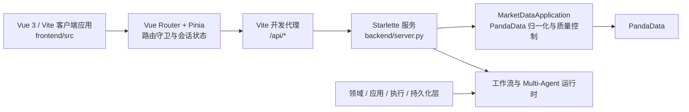

# Finance-God 项目索引

> 基于仓库当前工作区建立，更新时间：2026-07-24。本文只描述已检出的代码与文档；未提交改动也已纳入索引，但不代表它们已经过验收或合并。

## 1. 项目定位与入口

Finance-God 是面向桌面端的仿真交易工作台：真实行情通过 PandaData 提供，账户、订单、成交与执行数据均应保持仿真标识；研究和编排能力建立在内置的 `verifolio-unified-agents` 运行时之上。

| 入口 | 用途 | 主要依赖 |
| --- | --- | --- |
| `README.md` | 安装、Multi-Agent、离线实验与索引入口 | Python 运行时、环境变量 |
| `backend/main.py` | Multi-Agent 最小演示入口 | `MultiAgentRuntime`、`Orchestrator` |
| `backend/server.py` | Starlette HTTP 服务、PandaData 标准化行情接口、原型静态文件 | Starlette、PandaData、工作流运行时 |
| `frontend/` | Vue 3 / Vite 客户端应用；登录、画像与管理员配置 | Vue Router、Pinia、Axios |
| `backend/scripts/run_workflow_experiments.py` | 离线场景工作流实验 | 本地 Agent 运行时 |

## 2. 目录地图

| 路径 | 职责 | 优先阅读文件 |
| --- | --- | --- |
| `docs/prd/` | 产品需求、用户旅程与 MVP 范围 | `Finance-God_交易台_PRD_v1.0.md` |
| `docs/page-design/` | 前端规范、页面规格、设计 brief 与验收材料 | `04_Finance-God前端设计要求.md`、`00_交易页面设计索引.md` |
| `docs/architecture/` | Agent Swarm 技术设计 | `agent-swarm-technical.md` |
| `docs/experiments/` | 离线工作流实验设计和产物约定 | `workflow-experiments.md` |
| `docs/specs/` | 早期产品方案与规划输入 | `AI投顾产品设计方案_e991b61e.md` |
| `backend/finance_god/domain/` | 不可变领域模型、状态机、交易与账本约束 | `models.py`、`ledger.py`、`simulation_rules.py` |
| `backend/finance_god/application/` | 应用服务、账本投影、端口和冲正规则 | `ledger_service.py`、`ports.py` |
| `backend/finance_god/execution/` | 仿真订单草稿、风控确认、撮合与执行服务 | `service.py`、`matcher.py`、`contracts.py` |
| `backend/finance_god/market_data/` | PandaData 适配、归一化、质量、时效和发布 | `service.py`、`adapter.py`、`coordinator.py` |
| `backend/finance_god/orchestration/` | Agent 选择、计划、工作流注册、执行和持久化运行时 | `workflows.py`、`workflow_runtime.py`、`multi_agent.py` |
| `backend/finance_god/infrastructure/persistence/` | SQLAlchemy 模型、仓储与工作单元 | `models.py`、`workflow_persistence.py`、`simulation_repository.py` |
| `backend/finance_god/api/` | 仿真执行与工作区 HTTP 路由定义 | `simulation.py`、`workspace_routes.py` |
| `backend/alembic/versions/` | 数据库演进脚本 | 见“数据库迁移” |
| `backend/tests/` | 后端行为、契约、迁移与持久化测试 | 按领域子目录定位 |
| `frontend/src/router.ts` | Vue Router 路由、用户与管理员会话守卫 | `createAppRouter()` |
| `frontend/src/views/` | 登录、画像、报告与管理员设置页面 | 各 `*View.vue` |
| `frontend/src/stores/` | 用户、管理员和画像流程状态 | `auth.ts`、`adminAuth.ts`、`onboarding.ts` |
| `frontend/src/api/` | Axios 客户端、认证头和标准响应解包 | `client.ts` |
| `frontend/src/services/` | 画像、管理员设置与工作台交接领域逻辑 | `profile.ts`、`admin.ts`、`workbench.ts` |
| `frontend/vite.config.ts` | Vite 开发服务器、`/api` 代理和 Vitest 配置 | `defineConfig()` |
| `backend/vendor/verifolio-unified-agents-0.2.0/` | 固定版本的第三方 Agent 运行时源码 | 仅在调试运行时适配时阅读 |
| `artifacts/`、`resources/` | 本地实验产物与外部参考资源 | 已忽略，不作为提交内容或索引对象 |

## 3. 运行时架构与数据流

### 3.1 当前前端接线

1. `frontend/src/main.ts` 创建 Vue 应用、Pinia 和路由；`bootstrapApplication()` 在挂载前恢复已有用户与管理员会话。
2. `frontend/src/api/client.ts` 使用 Axios 调用 `VITE_API_BASE_URL`（默认 `/api/v1`），为用户与管理员会话分别注入 Bearer token，并解包标准 API 响应。
3. `frontend/vite.config.ts` 的 `/api` proxy 只用于本地开发，目标为 `http://localhost:8000`；生产部署必须由同源反向代理提供该边界。
4. 当前前端未挂接 PandaData 行情展示、共享轮询或交易工作区。恢复这些能力时，必须按 `04_Finance-God前端设计要求.md` 建立统一轮询、时效状态和真实/仿真数据边界。

### 3.2 后端分层

| 层 | 责任 | 主要模块 |
| --- | --- | --- |
| Domain | 定义业务对象、状态转换和不变量 | `domain/`、`trading/` |
| Application | 通过端口协调账本、投影与冲正 | `application/` |
| Execution | 管理订单草稿、复核、风险确认、提交、撤销、撮合 | `execution/` |
| Orchestration | 选择 Agent、生成并运行工作流、记录审计结果 | `orchestration/`、`agents/` |
| Infrastructure | 将领域协议映射至 SQLAlchemy / 数据库 | `infrastructure/persistence/` |
| API | 将 HTTP 请求转换为应用服务调用 | `api/`、`server.py` |

## 4. 前端路由索引

路由由 `frontend/src/router.ts` 显式声明；认证状态存于浏览器 `localStorage`，启动时由 Pinia store 恢复。当前页面是画像和管理员配置流程，不是交易工作区；交易页实现前仍须遵循 `docs/page-design/04_Finance-God前端设计要求.md`。

| URL | 页面文件 | 主要职责 | 当前数据来源 |
| --- | --- | --- | --- |
| `/` | `router.ts` | 根据用户会话跳转至登录或画像流程 | 浏览器本地会话 |
| `/login` | `views/LoginView.vue` | 用户登录与注册 | `/api/v1` 用户认证接口 |
| `/app/exe` | `views/OnboardingView.vue` | 投资画像问答 | 用户会话与画像接口 |
| `/app/profile-report` | `views/ProfileReportView.vue` | 画像与推荐方向报告 | 用户会话与画像接口 |
| `/admin/login` | `views/AdminLoginView.vue` | 管理员登录 | 独立管理员会话接口 |
| `/admin/ai-settings` | `views/AdminSettingsView.vue` | 管理员 AI 配置 | 管理员会话与设置接口 |

### 前端共享状态与服务

| 模块 | 责任 |
| --- | --- |
| `stores/auth.ts` | 用户 token、用户信息及会话恢复 |
| `stores/adminAuth.ts` | 独立的管理员 token、用户信息及会话恢复 |
| `stores/onboarding.ts` | 画像问答、草稿、请求标识与推荐方向选择 |
| `api/client.ts` | API client、认证拦截器、错误转换和响应解包 |
| `services/profile.ts` | 画像内容本地化与可选推荐方向筛选 |
| `services/admin.ts` | AI 设置编辑载荷与业务校验 |
| `services/workbench.ts` | 完成画像后的安全跨窗口工作台通知 |

## 5. HTTP API 索引

### 5.1 当前由 `backend/server.py` 挂载

| 方法 | 路径 | 作用 |
| --- | --- | --- |
| `GET` | `/api/live` | 存活探针 |
| `GET` | `/api/ready` | 工作流和行情依赖就绪检查 |
| `GET` | `/api/health` | 汇总健康状态，标识 PandaData 与 simulation 模式 |
| `GET` | `/api/market/quotes?symbols=...` | 批量标准化报价 |
| `GET` | `/api/market/bars?symbol=...&limit=...` | 标准化 K 线 |
| `GET` | `/api/market/catalog` | PandaData 能力目录 |

### 5.2 已定义但尚未由 `server.py` 挂载

`backend/finance_god/api/simulation.py` 的 `create_simulation_routes()` 已定义以下仿真执行接口：账户创建/重置/读取、草稿创建/复核/风险确认/确认/提交、订单查询/对账/撤销、成交查询。该工厂要求注入 `SimulationExecutionService` 与账户应用服务，并要求 `x-finance-god-owner-id` 和 `idempotency-key` 请求头。

`backend/finance_god/api/workspace_routes.py` 包含自选、通知、偏好与任务的路由雏形；当前 `backend/server.py` 的 `routes` 表未导入或挂载该模块。因此前端中对应的“服务不可用”状态与后端实际接线一致，不应误认为已经可访问。

## 6. 数据库迁移索引

| 修订号 | 文件 | 依赖 | 主题 |
| --- | --- | --- | --- |
| `20260723_0001` | `20260723_0001_simulation_ledger.py` | 无 | 仿真账本、账户、现金、持仓与预留 |
| `20260724_0002` | `20260724_0002_workflow_runtime.py` | `20260723_0001` | 工作流运行、事件与审计 |
| `20260724_0003` | `20260724_0003_simulation_execution.py` | `20260724_0002` | 仿真草稿与订单执行 |
| `20260724_0004` | `20260724_0004_workspace_services.py` | `20260724_0003` | 自选、通知、偏好与任务的工作区服务表 |

迁移链当前为线性关系：`20260723_0001 → 20260724_0002 → 20260724_0003 → 20260724_0004`。执行迁移前仍应以 Alembic 的当前版本检查为准。

## 7. 测试与验证入口

| 范围 | 位置 | 常用命令 |
| --- | --- | --- |
| 后端单元/契约测试 | `backend/tests/{domain,ledger,market_data,trading,workflows,...}` | `cd backend && .venv/bin/python -m unittest discover -s tests -v` |
| Python 编译检查 | `backend/finance_god/`、`backend/tests/` | `cd backend && .venv/bin/python -m compileall -q finance_god tests` |
| 前端类型检查 | `frontend/` | `cd frontend && npm run type-check` |
| 前端构建 | `frontend/` | `cd frontend && npm run build` |
| 前端单元测试 | `frontend/src/tests/` | `cd frontend && npm test` |

前端测试覆盖路由会话守卫、管理员会话隔离、画像流程、API 响应契约与主要页面交互。当前没有 lint 或 E2E 脚本；新增前端能力时应在同一变更中补齐相应验证入口。

## 8. 当前接线状态与维护注意事项

- 当前端到端前端主路径是用户/管理员认证与投资画像。PandaData 后端能力已存在，但尚未由当前 Vite 前端消费。
- 订单、账户、工作区和工作流持久化模块已存在，但仿真与工作区 HTTP 路由尚未接入 `server.py`；实现页面业务联通时应先组合依赖和挂载路由，而不是在前端填充模拟返回值。
- `backend/vendor/` 为固定第三方源码，普通业务修改不应直接落入该目录。
- 本地依赖、构建结果、测试报告、实验产物、运行时 SQLite 数据库和 `.playwright-cli/` 会被忽略；不得将其作为源码或文档提交。
- 已清理未被引用的 “` 2`” 后缀副本；同名正式文件是唯一维护入口。
- 当前工作区仍存在未提交的业务改动；提交前应将迁移链、API 装配和相应测试作为同一变更集核验。
- 任何前端变更均需先阅读前端设计规范、验收模板及受影响路由的页面规格，见根目录 `AGENTS.md`。

## 9. 索引维护规则

当以下任一结构发生变化时，同一变更集必须更新本文：根目录入口、`docs/` 分类、Vue Router 路由、HTTP 路由、Alembic 修订链、测试入口或忽略规则。索引以实际文件、导入关系与测试配置为准，不将未挂载 API 或本地生成目录描述为可用能力。
